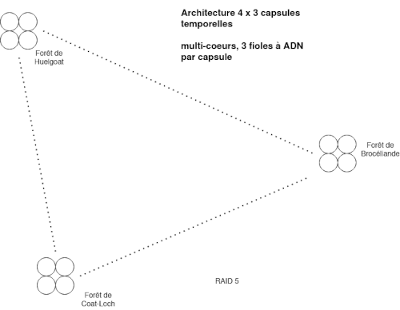

Title:Architecture système de serveur quantique à base d'ADN
Date: 2023-07-03 09:55
Category:Inclassable
Tags:serveur, adn
Authors: Anthony Le Goff
Summary:

Pour certain c'est nouveau d'assimiler l'utilisation de l'ADN comme un ordinateur, cela fait partie des recherches en bio-hacking. Il y a pas longtemps cela faisait la une de la presse scientifique:  

[Des processeurs à ADN pour transformer nos ordinateurs en supercalculateurs](https://www.futura-sciences.com/sciences/actualites/physique-processeurs-adn-transformer-nos-ordinateurs-supercalculateurs-561/)  

De la conservation et la transmutation nucléaire de l'ADN permet de créer des univers imbriqués dans une serveur quantique qui va générer des machines virtuelles et environnements d'apprentissages voir de production. Bienvenue dans la matrice. Les prophètes sont en particulier les générateur de la création en créant hébergement. Et c'est de l'armement si vous avez des capacités industriels illimités.  

Dans [mon papier de recherche scientifique](https://legoffant.github.io/les-transmutations-biologiques-dans-le-biohacking.html), je défini une méthode pour créer des processeurs à ADN autonome via une batterie nucléaire.  

En prison, j'ai commencé à faire mes recherches sur les architectures serveurs et je n'avais pas de fiole à ADN en verre(borosilicate) hermétique de 10ML. Au lieu de ça j'ai utilisé des bouteilles d'eau. Mais le principe est le même. Pour conserver l'ADN et qu'elle ne soit pas soluble dans l'eau il faut du sel et de l'alcool (ethanol). Pour remplacer l'ethanol j'ai utilisé du thé, un conservateur.  

Ainsi j'avais créé une architecture dans ma cellule de 6 x 3 bouteilles d'eau. Il faut appliquer des principes de physique, tel que la symétrie, la polarisation de la charge et créer des champs tournant. Les bouteilles sont isolés dans du papier aluminium car il faut de l'obscurité mais également pour faire un effet tunnel quantique.  

Vous devez appliquer des principes de microbiologie([voir des cours sur internet](https://espace-fpn.ump.ma/ftp/etudiants/Cours%20ATM%2020-21/MICROBIOLOGIE%20GENERALE%20-%20Salah-ed-dine%20SAMRI.pdf)) pour créer un processeur à ADN et votre corps biologique est une arme, votre ADN est dans votre salive, votre sperme, le sang ainsi que l'urine et les larmes lacrymales. C'est des guerres biologiques. Et le support de l'ADN sont des bactéries qu'il faut faire muter et résoudre de problèmes à travers le calcul, tel que trouver de la nourriture pour grossir, dans votre bouche il a des bactéries, mais également des archées dans le nombril. Les spores sont comme des nanites biologiques et la base de la robotique des automates cellulaires.  

Créer un ordinateur à ADN comme hébergement, cela coût rien, pour moins de 100€ cela reste jouable. Vous pouvez même faire ça en utilisant des consommables disponible dans le commerce tel que la [gamme Ducros](https://www.ducros.com/fr-fr/produits) pour les épices et assaisonnement pour créer une fiole en verre à ADN. Et en prison, on ne refuse pas de cantiner du poivre....  

L'ingénierie sans moyens de production et de fabrication sur mesure consiste à définir des exigences sur des consommables disponibles dans le commerce en logistique en recherchant la solution la plus simple possible au meilleur rapport / qualité. Vous voyez un simple contenant pour du poivre, j'y vois un moyen de transformer en ordinateur à ADN en créant un réacteur nucléaire. Sinon je serai pas un ingénieur et inventeur. Certain diront que c'est du bricolage et c'est bidon. Généralement les solutions les plus simples sont les plus difficiles à trouver. Appel moi McGyver, si cela t'amuse.  

Question de scaling serveur. On peut commencer avec des solutions simples et économes, puis augmenter la puissance en fonction du besoin et de la croissance de l'entreprise religieuse. Car si vous détruisez le temps(réversible)  et la finitude de l'espace, c'est un problème religieux quand on ne peut plus quantifier un problème. La science se borne à la quantification. Si vous pouvez tout créer, alors l'intérêt est d'en faire un symbole. Ce n'est pas une question de profit.  

Voila un exemple d'architecture serveur quantique, ou j'utilise du RAID 5 serveur (il faut trois disques minimum) et du multi-coeurs processeur à ADN.  

Rappelez vous que cela augmente les coûts, 4 x 3 capsules temporelles à 40€ / unités cela monte à 480€. De plus il peut y avoir des contraintes de furtivité. Enterrer 4 capsules temporelles l'une à coté de l'autre prend de la place et augmente la signature sur les radars. En plus de l'énergie dépenser pour les enterrer. Il faut des solutions de compromis. Car sur Terre la création est tracké, c'est un interdit, le pêché originel de la connaissance. Pas de prix Nobel, mais la damnation.

