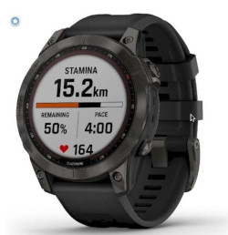

Title:Les montres  
Date: 2023-07-13 17:17
Category:Inclassable
Tags:montres, horloges
Authors: Anthony Le Goff
Summary:

Parlons montre, je n'aime pas le luxe et les Rolex, donc je vais forcément rater ma vie. Je trouve totalement abhérent la complexité chez les horlogers pour augmenter le prix alors qu'une simple montre à quartz digital est plus précise. Je suis très pragmatique, et les matériaux de qualité à part peut-être du Saphir pour empecher les rayures sur le verre. Peu d'intérêt.  

Les montres sont le domaine ou il y a le plus d'arnaque, et les Suisses sont des experts pour faire augmenter les prix sur les modèles de luxe. Les Suisses sont des prétentieux, sachez-le en horlogerie.  

Ce que vous devez rechercher sur une montre est l'autonomie, changer le moins souvent la batterie + 3 ans ou alors les modèles automatiques, pour remonter avec le mouvement du poignet tel que chez Seiko qui a inventé la technologie "[Kinetic Perpetual"](https://www.seikowatches.com/fr-fr/customerservice/knowledge/kinetic-perpetual-knowledge)  

Oublier les montres connectés comme l'Apple Watch, c'est de la daube. Fuyez. 36 heures d'autonomies, tous les deux jours elle monopolise votre chargeur électrique. Un gadget de geek totalement inutile.  

### Montres du quotidien  

**Festina** F16253/1 collection générale multi-fonction - 120€  

Ma première montre "adulte" comme cadeau quand j'étais adolescent, une Festina car je suis un cycliste et c'était une équipe du Tour de France, dont à fait partie Richard Virenque, avec une affaire célèbre de dopage. Elle ma suivit même jusqu'en prison et m'a permis de faire le Salat Islamique. Puis elle a laché en UMD, et donc j'ai arrêté la prière.  

*   **Verre** Minéral  
    
*   **Affichage** Analogique  
    
*   **Mouvement** Quartz / Batterie  
    
*   **Bracelet** Acier  
    
*   Water resistant  
    

Fonctions:  

*   Calendrier  
    

  

**Casio** A700WE Collection Vintage - 44€  

Ma montre actuelle qui a 4 ans. Elle est déjà très abimé, et peu résistante au niveau de la peinture. Idéal pour être à l'heure, les montres quartz digital sont très précises et décale très peu l'heure. C'est le meilleur rapport qualité / Prix.  

*   **Verre** Mineral  
    
*   **Affichage** Digital  
    
*   **Mouvement** Quartz / Batterie 3 ans autonomie  
    
*   **Bracelet** Acier  
    
*   Water resistant  
    

Fonctions:  
    
*   retro-eclairage LED  
    
*   Chronomêtre  
    
*   Calendrier  
    
*   Alarme  
    

Lien d'achat [https://www.creationwatches.com/products/fr/casio-digital-350/casio-youth-digital-a700w-1a-a700w-1-alarm-quartz-mens-watch-16872.html](https://www.creationwatches.com/products/fr/casio-digital-350/casio-youth-digital-a700w-1a-a700w-1-alarm-quartz-mens-watch-16872.html)  

### Montres Trekking / Montagne / Militaire  

Seiko 5 military SNK805K2 - 130€  

Mon choix que je vais acheter sous peu, dans les 6 mois à venir pour le Trekking. Un modèle militaire d'entrée de gamme.  

*    **Verre** Mineral  
    
*   **Affichage** Analogique  
    
*   **Réserve de marche** 40 h  
    
*   **Mouvement** Remontage automatique  
    
*   **Bracelet** Nylon  
    
*   Water Resistant  
    

Fonctions:  

*   Calendrier  
    

Lien d'achat: [https://www.creationwatches.com/products/fr/seiko-mens-watches-208/seiko-5-military-automatic-nylon-snk805k2-mens-watch-1716.html](https://www.creationwatches.com/products/fr/seiko-mens-watches-208/seiko-5-military-automatic-nylon-snk805k2-mens-watch-1716.html)  

  

Garmin Fenix 7 Sapphire Solar - 750€  

C'est une montre référence pour l'aventure et les militaires, avec énormement de fonction et une autonomie solaire à un prix haut de gamme de chez Garmin. Pour les radins Il faut mieux acheter une montre basic comme la Seiko 5 à 130€ + [Garmin Foretrex 601](https://www.garmin.com/fr-FR/p/572639) à 240€. Economie de + 350€.

*   **Verre** Power Sapphire™  
    
*   **Affichage** Antireflet, MIP transflectif  
    
*   **Mouvement** Solaire  
    
*   **Bracelet** Silicone  
    
*   **Mémoire** 32GO  
    
*   **Durée de vie de la batterie** 57 heures  
    
*   Water Resistant  
    

Fonctions:  

*   Alarme  
    
*   Ephéméride  
    
*   Chronomètre  
    
*   Fréquence cardiaque  
    
*   GPS  
    
*   Altimètre barométrique  
    
*   Compas  
    
*   Gyroscope  
    
*   Accéléromêtre  
    
*   Thermomètre  
    

Lien d'Achat [https://www.amazon.fr/dp/B09RG5LL9Z?tag=montremilit06-21&linkCode=ogi&th=1&psc=1](https://www.amazon.fr/dp/B09RG5LL9Z?tag=montremilit06-21&linkCode=ogi&th=1&psc=1)