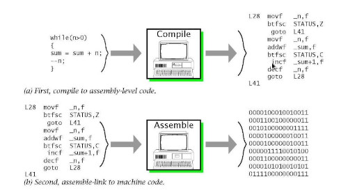
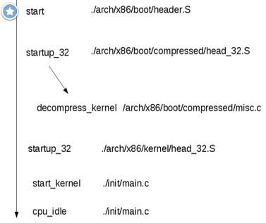

Title:Les principes des machines à leur programmation
Date: 2023-07-05 08:39
Category:Linux
Tags:machine, assembleur, compilateur
Authors: Anthony Le Goff
Summary:

Pour une machine, tout commence par un signal électrique. Un courant qui est généré par des charges dans un conducteur avec des électrons. On a donc inventé les semi-conducteurs en particulier le transistor qui est la base des ordinateurs et c'est un commutateur.  

### Le transistor  

A la même époque vont naître les travaux sur les machines de Turing et les architectures de Von Neumann qui sont la base de la conception des ordinateurs moderne.  

Le transistor a été inventé en **1947** par trois ingénieurs américains des laboratoires Bell : **John Bardeen, Walter Brattain** et **William Schockley**. L’invention de ce dispositif qui permet de détecter et d'amplifier les courants électriques leur a valu le **prix Nobel de physique en 1956**. John Bardeen va remporter un second Prix de Nobel de physique en 1972, il oriente ses recherches vers la compréhension des mécanismes de la **supraconductivité**. La formulation d'un modèle de couplage d'électrons et de leurs interactions avec les vibrations du réseau cristallin des solides sous le nom de théorie BCS, des initiales de Bardeen et de ses collègues **Leon Neil Cooper** et **John Robert Schrieffer**, permet d'expliquer les phénomènes de résistivité électrique nulle observés dans les supraconducteurs.  

Sur le principe un transistor est un commutateur qui permet de commander un courant électrique. C'est un signal carré. Soit ouvert ou fermé que l'on défini par 0 ou 1. Les systèmes de traitement du calcul travail que sous forme binaire. Ce que l'on appel les bits. C'est le langage machine. Celui-ci admet des cycles de traitement de l'information à travers une fréquence en Hertz, ce qui permet d'avoir une horloge.  

L'assemblage de plusieurs transistors permet de créer des circuits logiques utilisant l'algèbre de Boole. Ainsi on utilise des portes logiques (AND, NOT, OR, XOR, NAND) permettent de traiter des instructions du processeur sur la logique combinatoire basé sur des [propositions et des prédicats](https://zestedesavoir.com/tutoriels/2256/de-la-logique-aux-processeurs/la-logique-des-propositions-et-des-predicats/).  

### La représentation de l'information  

La base de la théorie de l'information de Shannon est le bit. Un regroupement de 8 bits correspond à l'octet qui prend la valeur de 0 à 255. Pourquoi 8 bits? C'est des puissances de 2 (8 = 2^3) qui permet d'accélérer le traitement du code informatique. Ainsi on converti le binaire en base 16 hexadécimal qui est un regroupement de 2 x 8 bits (Octets). Mais il y a d'autres base, en particulier pour améliorer la cryptographie tel que la base 36, 64, 128, 256 qui sont des puissances de 2, voir certaine des bases carrés. sqrt(16) = 4, sqrt(36) = 6, sqrt(64) = 8 . Un système de nombre en informatique pour optimiser le calcul utilise une base de puissance de 2 (binaire) avec une combinaison de base carré. En cryptographie le MD5 est un hash sur 128 bits sur la base 64. Il est donc nécessaire de faire des changements de base entre des systèmes numériques ce qui augmente le temps de calcul et donc de casser le code. Sha-256 est une des fonctions de hachage les plus efficaces actuellement en base 64. Une base 512 se forme sur 8x8x8 et donc plus de 512 caractères différents. 8 étant une puissance de 2 et représente un octet.  

Pour représenter les caractères on a inventé une table nommé ASCII. Ce qui est suffisant pour l'anglais et l'alphabet codé sur 255 valeurs et donc un octet. Mais cela n'est pas suffisant pour le chinois et ces symboles, il faut de l'UTF-8. Ce qui augmente les temps de traitements pour calculer et déchiffrer du code qui est basé sur 214 radicaux. l'UTF-8 pouvait coder n'importe quel point de code entre U+0000 et U+7FFFFFFF (donc jusqu'à 31 bits).  

Il y aurai également a traiter les nombres en particulier les flottants qui ont une représentation spécifique.  

### CPU  

Les composants du CPU des ordinateurs:  

*   Bus : nappes transportant l'info  
    
*   Registres : emplacements de stockage à accès rapide  
    
*   ALU :unité de calcul (entiers et booléens)
*   Unité de contrôle :interprète les instructions
*   Horloge :cadence les instructions  
    

Les architectures de processeur:  

*   x86-64 (Intel, AMD) : PC et compatibles  
    
*   ˆARM : beaucoup de téléphone, Raspberry Pi
*   PowerPC (IBM) : Wii, PS3, XBox 360
*   ˆMIPS, RISC-V etc.  
    

Les instructions machine:  

Instruction Set Architecture (ISA): modèle qui définit comment le logiciel contrôle le hardware (code binaire)  

chaque processeur possède son propre jeu d'instructions machine

*   ARM is RISC (Reduced Instruction Set Computing)  
    
*   x86 is CISC (Complex Instruction Set Computing)
*   chaque instruction possède un identifiant numérique : opcode  
    

ˆLa programmation directe du processeur avec les instructions machines estˆ difficile, fastidieuse et quasi-impossible à comprendre. Le **microcode** est un programme composés de micro-instructions dont l'exécution au sein du processeur ou microprocesseur définit le jeu d'instructions de celui-ci.  

**RISC-V** (prononcé en anglais « RISC five » et signifiant « RISC cinq ») est une architecture de jeu d'instructions (instruction set architecture ou ISA) RISC ouverte et libre, disponible en versions 32, 64 et 128 bits. Ses spécifications sont ouvertes et peuvent être utilisées librement par l'enseignement, la recherche et l'industrie. Les specifications sont ratifiées de façon ouverte par la communauté internationale des développeurs.  

### Le langage assembleur  

C'est le langage le plus proche de la machine compréhensible par les humains. Il est variant en fonction de l'architecture du processeur défini par le constructeur. Les combinaisons de bits du langage machine sont représentées par des symboles dits « mnémoniques », c'est-à-dire faciles à retenir.  

Certaines opérations fondamentales sont disponibles dans la plupart des jeux d'instructions.

*   Déplacement dans la mémoire :
    *   chargement d'une valeur dans un registre ;
    *   déplacement d'une valeur depuis un emplacement mémoire dans un registre, et inversement ;
*   Calcul :
    *   addition, ou soustraction des valeurs de deux registres et chargement du résultat dans un registre ;  
        
    *   combinaison de valeurs de deux registres suivant une opération booléenne (ou opération bit à bit) ;  
        
*   Modification du déroulement du programme :
    *   saut à un autre emplacement dans le programme (normalement, les instructions sont exécutées séquentiellement, les unes après les autres) ;
    *   saut à un autre emplacement, mais après avoir sauvegardé l'emplacement de l'instruction suivante afin de pouvoir y revenir (point de retour) ;
    *   retour au dernier point de retour ;
*   Comparaison :
    *   comparer les valeurs de deux registres.

Et on trouve des instructions spécifiques avec une ou quelques instructions pour des opérations qui auraient dû en prendre beaucoup. Exemples :

*   déplacement de grands blocs de mémoire ;  
    
*   multiplication, division ;  
    
*   arithmétique lourde (sinus, cosinus, racine carrée, opérations sur des vecteurs) ;  
    
*   application d'une opération simple (par exemple, une addition) à un ensemble de données par l'intermédiaire des extensions MMX ou SSE des nouveaux processeurs.  
    

### Linux et la routine de démarrage du noyau  

Pour démarrer le noyau Linux au bootloader on utilise le langage assembleur, si vous voulez créer et comprendre les systèmes d'exploitation il est nécessaire de lancer le noyau en assembleur avant le traitement en langage C. Quand la bzImage (pour une image destinée au i386) est appelée, vous commencez à [./arch/x86/boot/header.S](https://elixir.bootlin.com/linux/latest/source/arch/x86/boot/header.S) dans la routine assembleur nommée start.  

### sysCall  

Les process utilisent les sysCall pour communiquer avec le noyau comme API avec l'assembleur. Les sysCall sont listés _dans /usr/include/asm/unistd.h_  

### Les compilateurs  

Le principal compilateur en langage C, nommé **GCC** est écrit en assembleur + C. Il permet également de produire du code en assembleur, car le compilateur converti les programmes en langage machine. Pour écrire du code assembleur pure et le compiler sur Linux on utilise NASM sans passé par l'intermédiaire du langage C. Je crois que c'est le seul compilateur GCC qui permet de traduire en assembleur. Le langage C est l'anneau de pouvoir de l'informatique ou tous les autres langages dérives mais également les compilateurs et interpréteurs. Ainsi l'interpréteur en Python(CPython) est écrit en langage C. Il faut donc apprendre le langage C dans les premiers langages de programmation et ce familiariser avec spécificité tel que l'accès à la mémoire et les pointeurs.