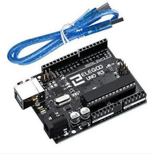
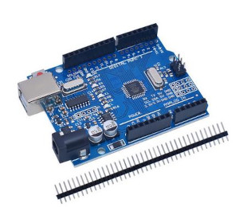

Title:Listing carte Arduino clone "form factor"
Date: 2023-06-29 12:16
Category:Inclassable
Tags:Arduino
Authors: Anthony Le Goff
Summary:

L'initiative Arduino(UNO date de sortie en 2010) et le développement des cartes de prototypage électronique est devenu une jungle, car tous le monde veut créer son propre produit avec des nouvelles caractéristiques ou à bas prix pour casser la concurrence, avec des risques de produits mal conçu en particulier sur les soudures.  

C'est l'objectif de l'Open Hardware de distribuer à un très large public l'accès à l'électronique et la robotique dans la mouvance maker et de l'open source qui a explosé depuis la mise en place des Fablabs dont la [charte du MIT](https://fr.flossmanuals.net/fablab-hackerspace-les-lieux-de-fabrication-numerique-collaboratif/charte-des-fablabs-du-mit/) a été rédigé le 20 octobre 2012. Tiers-lieux ont poussé comme des petits champignons dans les villes mais également dans la R&D des entreprises d'ingénierie. Il existe environ 3000 Fablabs dans le monde dont 1500 certifié par la charte du MIT. Les produits les plus plébiscité sont en particulier l'imprimante 3D (RepRap) ,Arduino UNO et Raspberry Pi.  

L'avantage d'Arduino UNO R3. Il y a une large documentation dans toutes les langues et une communauté. Mais ce n'est pas toujours le cas pour les autres cartes clones (pas de datasheet, guide de lancement, etc) C'est un monde relativement obscure, même si sur le principe, le fonctionnement est équivalent. Un côté pour "Evil Mad Scientist" et "Early Adopter".  

Je vais donc lister quelques cartes Arduino UNO, des clones, leurs caractéristiques et le prix.  

### Arduino UNO R3  

La carte Arduino Uno est basée sur un ATmega328 8bits cadencé à 16 MHz. C'est la plus simple et la plus économique carte à microcontrôleur d'Arduino. Elle va être remplacé par le modèle R4 minima sortie en 2023.  

Caractéristiques:  

*   Alimentation:  
    \- via port USB ou  
    \- 7 à 12 V sur connecteur alim 5,5 x 2,1 mm
*   Microcontrôleur: ATMega328
*   Mémoire flash: 32 kB
*   Mémoire SRAM: 2 kB
*   Mémoire EEPROM: 1 kB  
*   Interfaces:  
    \- 14 broches d'E/S dont 6 PWM  
    \- 6 entrées analogiques 10 bits  
    \- Bus série, I2C et SPI
*   Intensité par E/S: 40 mA
*   Cadencement: 16 MHz
*   Gestion des interruptions
*   Connecteur USB B
*   Version: Rev. 3  
*   Dimensions: 74 x 53 x 15 mm  
    

Prix: [23€ chez Gotronic](https://www.gotronic.fr/art-arduino-uno-a000066-12420.htm)  

### Elegoo UNO R3  

C'est le grand concurrent d'Arduino et le meilleur rapport qualité /prix.  

Caractéristiques:  

*   ATmega328P microcontroller  
*   Input voltage - 7-12V  
*   5V Electric current: 500MA  
*   3.3V Electric current: 50MA  
*   14 Digital I/O Pins (6 PWM outputs)  
*   8 Analog Inputs  
*   32k Flash Memory  
*   16Mhz Clock Speed  
*   Component listing  
*   1pcs ELEGOO UNO R3 Development Board    
*   1 pcs USB cable  
    

Prix: [12$ sur le site officiel (out of stock)](https://www.elegoo.com/en-fr/products/elegoo-uno-r3-board)  

### UNO R3 pour Ardu37  

Le choix du radin sur des copies en Chine, méfiance sur la qualité des soudures.  

Datasheet très peu disponible en détails.  

Prix: [3,16€ sur AliExpress](https://fr.aliexpress.com/item/32932088536.html)  

### SparkFun RedBoard  

La RedBoard est un très bon produit compatible UNO à un prix accessible, la gamme RedBoard est très étendu avec des modules ESP32 ou encore un processeur RISC-V.  

Caractéristiques:  

*   ATmega328 microcontroller with Optiboot (UNO) Bootloader
*   USB Programming Facilitated by the Ubiquitous FTDI FT231X
*   Input voltage - 7-15V
*   0-5V outputs with 3.3V compatible inputs
*   14 Digital I/O Pins (6 PWM outputs)
*   6 Analog Inputs
*   ISP Header
*   32k Flash Memory
*   16MHz Clock Speed
*   All SMD Construction  
*   R3 Shield Compatible
*   Red PCB!  
    

Prix: [21$ sur Sparkfun](https://www.sparkfun.com/products/13975)  

### Adafruit METRO M0 Express  

L'entreprise d'électronique Adafruit a également développé son propre produit UNO. La carte METRO. En fonction de la gamme, elle permet de faire plus de chose tel qu'une comptabilité avec CircuitPython.  

Caractéristiques:  

*   ATSAMD21G18 @ 48MHz with 3.3V logic/power
*   256KB of FLASH + 32KB of RAM
*   2 MB SPI Flash chip
*   No EEPROM
*   32.768 KHz crystal for clock generation & RTC
*   3.3V regulator with 500mA peak current output
*   USB native support, comes with USB bootloader and serial port debugging
*   You also get tons of pins - 25 GPIO pins, 5 more than the Metro 328
*   Hardware Serial, hardware I2C, hardware SPI support
*   PWM outputs on almost all pins
*   6 x 12-bit analog inputs
*   1 x 10-bit analog output (DAC)
*   Built in NeoPixel on pin #40  
*   Pin #13 red LED for general purpose blinking
*   Power on/off switch
*   4 mounting holes
*   We also include 4 rubber bumpers to keep it from slipping off your desk
*   Reset button
*   Adafruit Black PCB with gold plate on pads
*   Dimensions: 71mm x 53mm / 2.8" x 2.1"
*   Height (w/ barrel jack): 13mm / 0.5"
*   Weight: 20g  
    

Prix: [25$ sur Adafruit](https://www.adafruit.com/product/3505)  

### Le cas des processeurs RISC-V  

Il existe des projets de board type UNO sous RISC-V mais cela reste encore un marché émergent, et une certaine guerre sur les semi-conducteurs: soyons clair ils torpillent le projets. Entre autres on peut noter:  

*   Sifive Hifive1 RevB (out of stock)  
*   Redboard-V (out of stock)  
*   WCH(Jiangsu Qin Heng) CH32V307VCT6+CH32V307V-EVT-R1 (dispo à 20$)     
*   Sipeed Maixduino (out of stock)