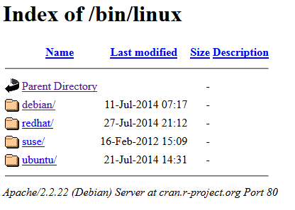

Title:Mirroring et Repository
Date: 2023-07-10 21:44
Category:Linux
Tags:mirror, repo
Authors: Anthony Le Goff
Summary:

Un concept essentiel dans le monde des hackers et Linux est l'hébergement de fichier sur un serveur Web HTTP ou un FTP. Que cela soit pour y accéder vous même à distance tel une archive ou tout simplement partager de l'information. Les robots des moteurs de recherche peuvent indexer ces fichiers, tel que du Web Crawling.  

C'est le fameux **Index of**. La racine du site.  

La page **Index of** indique que le répertoire cible concerné ne contient pas de fichier **index.php** ou **index.html**. Un fichier de ce type constitue le « _point d'entrée_ » de votre site web. Le nom de ce fichier est normalisé. Alors elle affiche les fichiers et dossiers avec les droits de lecture selon les permissions.  

On retrouve deux cas en particulier ou la page Index of est invoqué:  

*   Les sites de miroir (mirroring)  
    
*   Les dépôts (repository)  
    

Sous Windows, vous avez sûrement jamais entendu parler, alors que dans le monde de Linux, c'est la règle. Un simple web serveur sous Apache ou Nginx suffit, même si on peut configurer en FTP. Il est possible également de protéger en accès avec un mot de passe ou du SFTP via SSH.  

### Mirroring  

Sous Linux, la mise à jour du système fonctionne par des sites miroir qui sont des sources officielles de dépôts logiciels (package) mais également des .iso. Vous pouvez créer en auto-hébergement votre propre site miroir, mais faut avoir une bande passante importante.  

Exemple, sur l'adresse de Gandi.net en France, le repo des iso d'Arch Linux du mois de juillet 2023:  

[https://mirrors.gandi.net/archlinux/iso/2023.07.01/](https://mirrors.gandi.net/archlinux/iso/2023.07.01/)  

Les sites miroirs sont nombreux, l'intérêt est de répliquer des données, certains sont lents, d'autres ne sont pas protéger en HTTPS. Quand vous faites une mise à jour cela de l'importance. Sous Arch Linux c'est l'outil reflector et l'édition du fichier /etc/pacman.d/mirrorlist  

### Repository  

L'autre cas est un simple dépôt de document, PDF etc.... Tel qu'une librairie pirate, avec un peu de violation de droit d'auteur. Après tout dépend de la loi du pays, des ayants-droits et de l'hébergement.  

Les deux exemples que je connais sont:  

[https://doc.lagout.org/](https://doc.lagout.org/)  
[https://repo.zenk-security.com/](https://repo.zenk-security.com/) (français + 1700 livres en sécurité informatique)  

Mais il y en a d'autres dans le web obscure qui ne sont pas indexé. Il est possible de télécharger l'ensemble des fichiers sur un ordinateur en utilisant la commande wget.  

L'aspect important est sa capacité de **téléchargements récursifs**, avec lesquels il créé un miroir des sites Web. Il transfère des parties d’un site Web en suivant les liens et la structure des répertoires, créant ainsi des versions locales des pages Web.  

```bash
$ wget -r ftp://exemple.com/repertoire  
```

### Installer une interface sophistiquer de Repository avec h5ai  

La racine Index of d'un web serveur n'est pas très glamour, c'est un peu du brute de décoffrage.  



On va donc l'améliorer et la personnaliser avec un template sous php h5ai : [https://larsjung.de/h5ai/](https://larsjung.de/h5ai/)  

Quelques lignes de code pour configurer avec Nginx en HTTPS en utilisant mon propre exemple de projet sous lib.qasari.net. NOTA: il manque la génération de certificat SSL de Let's Encrypt avec certbot:  

Tools server  
```bash
$ apt get install nano vim nano wget unzip bash-completion  
```

Installation de php et nginx  
```bash
$ sudo apt install php-fpm nginx

$ systemctl status php-fpm
```

Télécharger h5ai  
```bash
$ cd /var/www && mkdir lib.qasari.net && cd lib.qasari.net  
$ wget https://release.larsjung.de/h5ai/h5ai-0.30.0.zip  
$ unzip h5ai-0.30.0.zip && rm h5ai-0.30.0.zip  
```

Structure tree  
```text
/var/www/lib.qasari.net/  
 ├─ \_h5ai  
 ├─ vos fichiers  
 └─ et vos dossier  
```

Il va falloir configurer un minimum h5ai pour cela direction le fichier de config de h5ai : `/_h5ai/private/conf/options.json`.  

Ne pas oublier de changer le détenteur du groupe:  
```bash
$ sudo chown -R www-data:www-data /var/www/lib.qasari.net  
```
  
Configuration Nginx  
```bash
$ sudo nano /etc/nginx/sites-available/lib.qasari.net
```

```text
#### Configuration du HTTPS  
server {  
     listen 443 ssl http2;  
     listen \[::\]:443 ssl http2;  
     server\_name lib.qasari.net;  
     root /var/www/lib.qasari.net;  
     index index.php /\_h5ai/public/index.php;

  
    # individual nginx logs for this vhost  
    access\_log  /var/log/nginx/lib.qasari.net\_access.log; # change to your own domain  
    error\_log   /var/log/nginx/lib.qasari.net\_error.log;  # change to your own domain  
          
    location ^~ /var/www/lib.qasari.net/\_h5ai/private {  
         deny all;  
         return 403;  
    }

    # configuration de php-fpm  
    location ~ \[^/\]\\.php(/|$) {  
        fastcgi\_split\_path\_info ^(.+?\\.php)(/.\*)$;  
         if (!-f $document\_root$fastcgi\_script\_name) {  
            return 404;  
        }  
        fastcgi\_pass unix:/run/php/php8.2-fpm.sock;  # change la version  
        fastcgi\_index index.php;  
        include fastcgi.conf;  
    }

    # configuration de SSL

    # Emplacement du certificat si on utilise Letsencrypt  
    ssl\_certificate         /etc/letsencrypt/live/..../fullchain.pem;  
    ssl\_certificate\_key     /etc/letsencrypt/live/..../privkey.pem;

    ssl\_session\_timeout     10m;  
    ssl\_prefer\_server\_ciphers   on;  
    ssl\_stapling            on;  
    ssl\_stapling\_verify     on;  
    ssl\_protocols           TLSv1.1 TLSv1.2;  
    ssl\_ciphers         "ECDHE-RSA-AES256-GCM-SHA384:ECDHE-RSA-AES128-GCM-SHA256:DHE-RSA-AES256-GCM-SHA384:DHE-RSA-AES128-GCM-SHA256:ECDHE-RSA-AES256-SHA384:ECDHE-RSA-AES128-SHA256:ECDHE-RSA-AES256-SHA:ECDHE-RSA-AES128-SHA:DHE-RSA-AES256-SHA256:DHE-RSA-AES128-SHA256:DHE-RSA-AES256-SHA:DHE-RSA-AES128-SHA:ECDHE-RSA-DES-CBC3-SHA:EDH-RSA-DES-CBC3-SHA:AES256-GCM-SHA384:AES128-GCM-SHA256:AES256-SHA256:AES128-SHA256:AES256-SHA:AES128-SHA:DES-CBC3-SHA:HIGH:!aNULL:!eNULL:!EXPORT:!DES:!MD5:!PSK:!RC4";

    add\_header Strict-Transport-Security "max-age=31557600; includeSubDomains";

    location ~ \\.(jpg|jpeg|gif|png|css|js|ico|svg|eot|ttf|woff|woff2|otf)$ {  
         access\_log        off;  
         expires           30d;  
    }  
}

#### Redirection HTTP vers HTTPS  
 server {  
     listen 80;  
     listen \[::\]:80;  
     server\_name lib.qasari.net;  
     return 301 https://lib.qasari.net$request\_uri;  
}
```

Link site enable:  
```bash
$ ln -s /etc/nginx/sites-available/lib.qasari.net /etc/nginx/sites-enabled/lib.qasari.net
```

Vérification et restart
```bash
$ nginx-t  
$ sudo systemctl restart nginx
```
