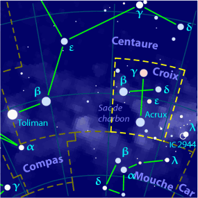
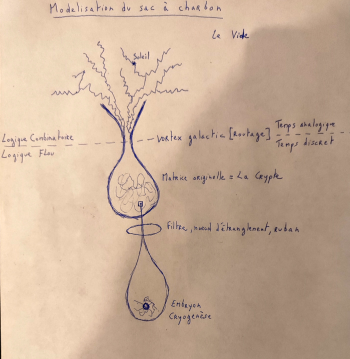
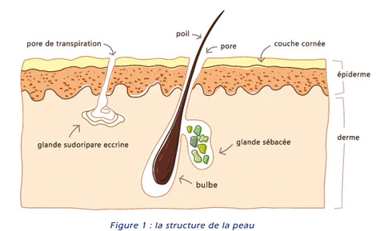

Title:Voile et Annihilation: La modélisation du sac à charbon
Date: 2023-08-10 20:40
Category:Inclassable
Tags:narkantisme, charbon
Authors: Anthony Le Goff
Summary:

On continu sur la série du créationnisme. Et comment on utilise du design de pattern. Car les signes d'Allah sont présent sur les secrets de la création à ceux qui observent. Un problème de perception?

Normalement la création s'étudie à travers la germination sur du terrain fertile. Ce qui se produit à l'échelle macrocosme dans l'univers est également à l'échelle microcosme car c'est récursif. Des automates cellulaires. 

Je vais expliquer la modélisation du sac à charbon sur les secrets de la création narkantique. A travers le rite de la caverne islamique et le tombeau des Patriarches pour invoquer la matrice originelle. 

Il faut suivre les signes, et le Christ utilise l'alignement galactique avec SGRA* du transit du soleil au soltice d'hiver vers le 21 décembre. C'est une porte. Un vortex. Et c'est un hypercube dans un environnement de cristal: réseau cristallin d'une structure d'un charbon en carbone. Le cube noir: la Kaaba islamique. C'est un noeud de routage. 

Dans le christianisme la mort du Christ est à Jerusalem car il invoque le judaisme et la coline de la citadelle de Sion en utilisant l'hébergement de la graine de Jehovah comme routage.

Ce que n'a pas fait l'Islam et Muhammad à la grotte de Hira. Il a hacké le système et contourné le par-feu de Jehovah. 

Petit pattern pour les amateurs d'astronomie et le sac à charbon à côté de la Croix du Sud.

Un peu plus d'explication et parlons du modèle du charbon.

Voila une représentation de la création dans des univers imbriqués à travers la modélisation du sac à Charbon. Pour certain cela ressemble à des gouttes d'eau, pour d'autres à des pores de peau dans l'épiderme.

Cela pose question sur le biomimétisme et les machines. N'êtes vous pas certain d'être hébergé sur une entité? A la forme d'un dragon? Un simple morceau de peau... Une immense galaxie... Question d'échelle sur le navire.

Dans la légende islamique, c'est occulté, le dragon à travers [Bahamut](https://fr.wikipedia.org/wiki/Bahamut). Et le créateur des dragons est introduit dans le silmarillion à travers Melkor. Un puzzle mondial. 

