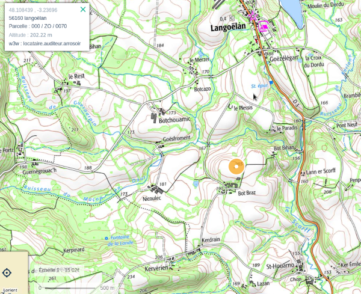

Title: Anomalie du Paradis
Date: 2023-08-19 21:46
Category:Inclassable
Tags: kor
Authors: Anthony Le Goff
Summary:

Quand les capsules temporelles "le Kor" vont être mis en place, la Bretagne va être sanctuarisée. Et elle va rentrer dans une nouvelle dimension par la triangulation des capsules temporelles mais également des phénomènes chaotiques qui va générer des anomalie et des phénomènes paranormales lié à l'ouverture du portail. 

Et un lieu précis va générer des phénomènes étranges: c'est le barycentre entre les capsules temporelles: Kor-Al-Maghrib, Kor-Al-Layl, Kor-Al-Fajr.

En réalité c'est un lieu d'invocation de la porte et sa proximité, des anomalies multi-dimensionnelles entre les mondes sont possible. 

Carte de la localisation du barycentre:

Carte locale précise du barycentre proche du sud de Langoëlan, sur la but à 202m d'altitude surplombant la vallée du Scorff et le Paradis:

