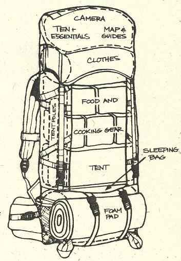
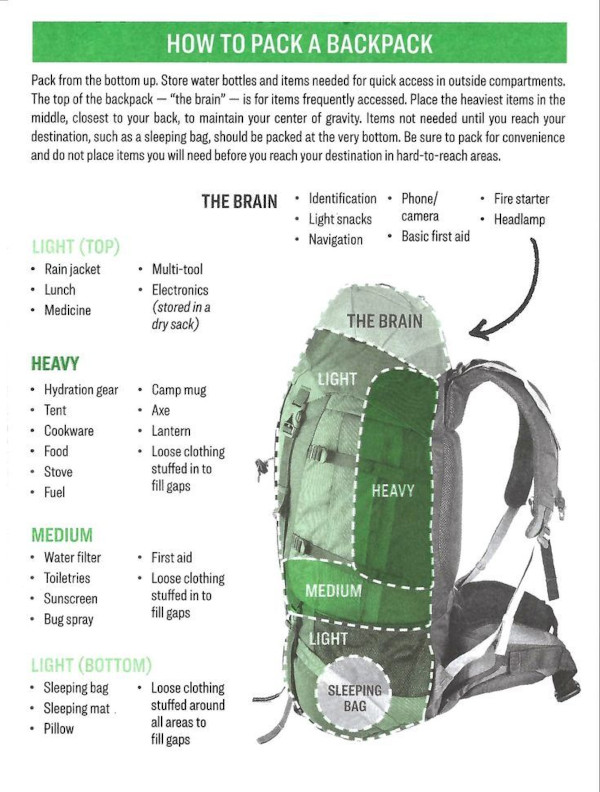
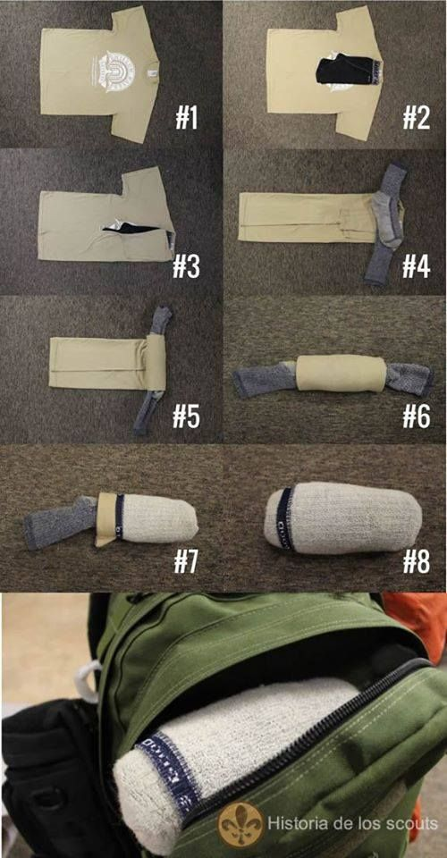

Title:Astuce rangement backpacking
Date: 2023-08-17 21:01
Category:Inclassable
Tags: trek, sac
Authors: Anthony Le Goff
Summary:

Les randonneurs et trekkers sont des pro du rangement avec leur sac, pour optimiser la place et l'accès à l'équipement mais également répartir la charge sur les épaules et les hanches pour limiter l'effort et d'avoir des blessures. Il faut ce montrer stratégique, votre veste impérméable hardshell ou poncho ne se met pas au fond du sac. 

**RAPPEL**: Votre sac ne doit pas dépasser 22% de votre poids au maximum, soit pour 70Kg = 15,4kg. Pour une charge optimum, on prend 70% du poids MAX soit 10,78kg. En Mode MUL (Marche-ultra légère) cela tombe à 50% soit: 7,7kg.

Vous avez donc intérêt à acheter de l'équipement léger en particulier:

* Sac de randonnée
* Tente
* Matelas
* Sac de couchage
* Réchaud et popote

A OPTIMISER

### Comment ranger son sac?

Il faut prendre en compte deux paramêtres:

* Le poids (répartition de la charge)
* L'utilité et l'accès à l'équipement

Quelques règles:

#### 1] Le fond de sac.
C’est le royaume de votre sac de couchage. Si votre sac dispose d’un accès direct par le bas, vous pourrez alors également y placer un ou deux vêtements utiles à la journée, type micro-doudoune. Si vous avez un accès frontal ou latéral, votre réflex peut également être placé à cet endroit, plutôt en partie basse.

#### 2] Le long du dos. 
On y place les éléments les plus lourds et denses : tente, réchaud et cartouches de gaz, popottes, boîtes, nourriture du soir. Le but est d’approcher au maximum le centre de gravité du sac au milieu de votre dos, afin de minimiser le plus possible l’effet de levier pour un effort minimum. C’est aussi dans cette zone que se trouvera votre poche à eau.

#### 3] La partie frontale. 
Viennent principalement s’y ranger les vêtements, qui ont pour particularité d’être légers et peu denses. L’autre intérêt est de pouvoir accéder à une doudoune ou à une cape de pluie, par exemple, par l’intermédiaire d’une ouverture rapide. Les vêtements peuvent également faire office de « calage » pour les éléments lourds situés le long du dos.

#### 4] Le dessus et les poches externes. 
C’est sur le haut du sac et dans les poches supérieures et latérales que l’on stockera tous les petits objets nécessaires au quotidien tel une carte, des lunettes, de la crème solaire, des barres énergétiques en cas de coup de moins bien… Cet espace pourra également accueillir votre veste imperméable, une polaire ou une doudoune, un appareil photo...

Schéma 1:

Schéma 2:

### Comment faire pour garder ses affaires au sec?

Les sacs ne sont pas impérméables et les affaires peuvent prendre l'eau et l'humidité, en particulier le papier, les vêtements ou les firestarters. Il faut donc prévoir plusieurs moyens:

* La housse anti-pluie inclus dans la plupart des sacs de rando / trek
* Des sacs poubelles
* [Des housses et pochettes en plastique](https://www.auvieuxcampeur.fr/activites/randonnee/sacs-a-dos-organisation-et-rangement/pochettes-etanches.html)
* Dry Bag.

L'intérêt est de **compartimenter** le sac en fonction des risques, et le dry bag sert à ça, en plus d'être imperméable. La marque la plus répandue est ["Sea To Summit"](https://seatosummit.fr/fr/95-sacs-etanches).

### Sac de compression

Comprimer les affaires encombrantes peut-être une solution pour gagner de la place, tel que des vêtements, la tente, le sac de couchage, des déchets etc... Toujours de la marque ["Sea To Summit"](https://seatosummit.fr/fr/96-compression-et-rangement).

### Compresser les vetements

Cette astuce permet de compresser des vetements et sous-vetements que j'utilise

### Hors du sac?

Vous pouvez mettre à l'extérieur attaché dans des sangles et mousquetons quelques outils qui craignent rien:

* La gourde filtrante
* Gobelets et tasses
* Matelas pliable en mousse
* Baton de randonnée
* Arceaux de tente
