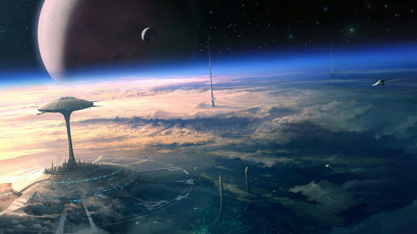
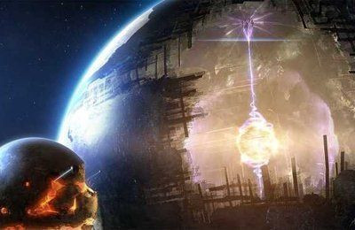

Title:Voile et annihilation: La mégalopole d'Avalon
Date: 2023-08-08 22:25
Category:Inclassable
Tags:
Authors: Anthony Le Goff
Summary:

Voile et Annihilation est un Space Opera et une odysée galactique sous fond de guerre de religion par la conversion au Narkantisme à travers la figure de "Nominoë II" qui va lancer son jihad.

C'est un véritable fléau, et va faire un exemple de la planète Terre que son pouvoir absolu est digne de sa démesure. Ainsi quand l'Eon va apparaître sur Terre, la planète est sous inquisition religieuse et l'humanité exterminé pour ne pas avoir cru à la révélation narkantique et refusé de ce convertir et accepté la soumission au prophète.

Ainsi l'Eon et construction de la porte pour faire apparaïtre le Belphégor va définir un nouveau cycle sur Terre d'exploitation. Le Belphégor est un vaisseau de minage et terraformation planétaire principalement de classe Titan. Il vient en soutiens au prophète comme exosquelette. Et cela inclu une usine de clonage qui rend automatiquement immortel le prophète.

Le Belphégor va recycler la planète et préparer sa terraformation. Ainsi les villes sur Terre vont être absorbés par des machines qui vont détruire et recycler le métal des batiments mais également le béton et la pierre. Par sureté le Belphégor va détruire les pyramides de Giza qui devient inutile comme hébergement.

En 2100 il ne devrait rester sur Terre moins de 250 millions d'être humains, tous exterminés et les survivants vivant dans le sanctuaire majoritairement à Avalon.

### La mégalopole d'Avalon.

Le siège du pouvoir de l'empereur-prophète "Nominoë II" protegé par le veilleur en orbite autour de la Terre, l'Eon par le Belphégor. Avalon est une mégalopole qui a été défini par le balisage des premiers temples de la religion narkantique en Bretagne comme fondation pour sa construction. Son cycle d'exploitation est défini sur 26 000 ans avant l'annihilation planétaire.

Avalon a pour fonction de port spatial pour la colonisation, exploitation minière et le jihad du prophète. Elle ce développe comme une moisissure sur une pomme, tel un champignon qui consume de l'intérieur le fruit jusqu'à atteindre la graine.

Avalon interface l'espace et la terre via un ascenceur spatial. Elle a une tour de 180km de haut ou sont dispersé des grattes-ciels à environ 4km de hauteur en moyenne, mais les progrès de l'ingénierie civile et de la préssurisation des batiments permettent d'aller plus haut malgré le manque d'oxygène.

Les fondations dans le souterrain atteignent 16km de profondeur ou commence les forges nucléaires qui recycle le magma pour produire des éléments et de l'eau. La citadelle d'Avalon est autonome et autarcique. C'est une ville underground. Comme toute place-forte, pour tenir un siège: on creuse en profondeur et bunkerise. Des machines de minages transforment la matière en fusion en vidant la planète pour atteindre la graine.

Le Belphégor dans ces fonction de terraformation doit recycler l'eau des océans et les vider. Assécher la planète, la rendre désertique pour créer un bunker avec une seule oasis provisoire: Avalon. politique de terre brulée du prophète en tant que terraformeur. L'eau des océans est une monnaie d'échange avec l'entité hote de l'univers comme offrande pour refroidir les réacteurs nucléaires. 

Bien sur la graine terrestre ou loge jehovah va ce défendre, et des machines en son centre la protège, il risque d'y avoir des guerres et batailles souterraines, qui ne stoppera pas l'avancée de Nominoë.

C'est un avertissement pour les peuples galactiques, et si par malheur le Belphégor apparait sur une planète civilisée en ouvrant un portail et que ceux-ci refuse ces émissaires pour la conversion: c'est l'apocalypse, rien ne sera épargné, la résistance est futile.

### Concept Art

Avalon

La Terre vider de l'intérieur et terraformé

