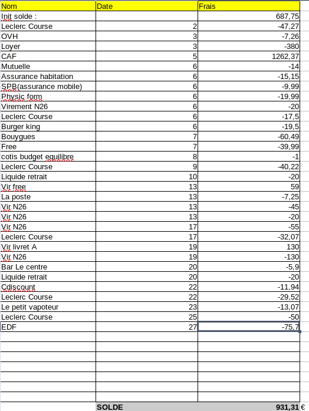
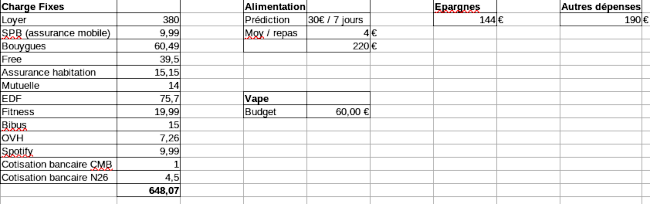

Title:Mois de budget typique
Date: 2023-11-24 02:38
Category:Inclassable
Tags:budget
Authors: Anthony Le Goff
Summary:

Je publie mon budget typique de ma gestion de mon argent, ayant des minimas sociaux et donc comment je gère en tant que profil de célibataire en appartement. Je suis devenu un expert pour placer mon argent avec un petits revenus, je suis un vrai écureuil. Alors j'explique un peu. Je suis très loin d'être placé sous curatelle car je serai pas gérer un budget. Je me débrouille très bien. malgré de grosse dépense en trek/rando + 3000€ et en équipement d'informatique / serveur + 2000€. Il me reste 3000€ d'économie en livret A. 

Si j'avais plus d'argent disponible j'investirai dans l'or et les diamants, voir du BTC à 10% de la totalité de mon épargne. A hauteur d'un lingot d'or de 20gr par an à 1300€.

Par mois mes dépenses d'extra:

* 2-3 resto(fast-food)
* 2-3 livres
* Quelques cafés au bar
* De la vape

J'ai deux comptes bancaire, un compte courant et livret A au CMB banque mutualiste bretonne basé à Brest, et un compte pour gérer d'autres dépenses / entrepreunariat sur N26 banque en ligne. Cela me permet également d'avoir une second carte bancaire au cas ou l'une tombe en panne. Pas la peine de chercher du financement du terrorisme, tu sera déçu.

Voici mon budget typique sur un mois, il y a des dépenses extra, des virements N26 qui sont mes achats pour le vapotage et de l'équipement de rando / trek, j'ai dépensé dans une tarp et des pelles / haches multifonctions pour 130€ depuis mon livret A. Pour le reste il y a ZERO DEPENSE. 

---

Alors on dirait, mais tu es ascète, cela fait parti des traditions religieuses dont islamique. Je pratique un peu oui. Je suis un farouche défenseur de l'auto-discipline qui a permit quelques succès dont finir en grande école d'ingénieur ou voyager jusqu'en Australie. Mais également j'ai très peu de dépense matériel, je ne suis pas un matérialiste, et attache très peu d'importance aux produits superflux et le luxe. Je pratique la modération et la renonciation à certain confort. Je n'ai plus de voiture.

Ainsi j'ai basculé dans une vie plutôt austère par la maladie psychique et psychotique, j'apprend donc à vivre avec peu. 
