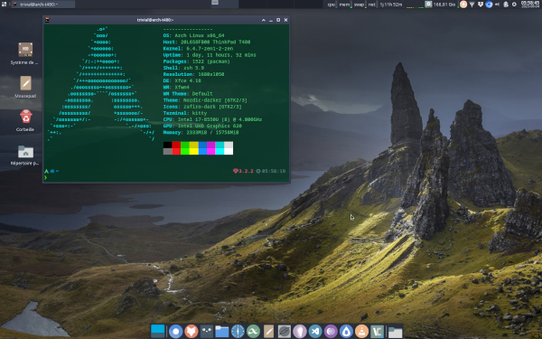

Title:Ma configuration de bureau sous Arch
Date: 2023-08-04 06:08
Category:Linux
Tags:bureau
Authors: Anthony Le Goff
Summary:

Un screenshot de mon bureau et ces paramètres sous Arch Linux

Miniature: 



[Lien de l'image en grand écran](https://imgbox.com/IEtxknsj)


Ma configuration de partionnement disque
```
$ lsblk -l       
NAME                                      MAJ:MIN RM   SIZE RO TYPE  MOUNTPOINTS
sda                                         8:0    1     0B  0 disk  
zram0                                     253:0    0     8G  0 disk  
luks                                      254:0    0   238G  0 crypt 
vg-arch                                   254:1    0   238G  0 lvm   /home
                                                                     /_snapshot
                                                                     /
nvme0n1                                   259:0    0 238,5G  0 disk  
nvme0n1p1                                 259:1    0   511M  0 part  /boot
nvme0n1p2                                 259:2    0   238G  0 part  

$ sudo btrfs subvolume list /                  
ID 256 gen 16059 top level 5 path @
ID 257 gen 16059 top level 5 path @home
ID 258 gen 9 top level 5 path @_snapshot
ID 259 gen 17 top level 256 path var/lib/portables
ID 260 gen 18 top level 256 path var/lib/machines
```