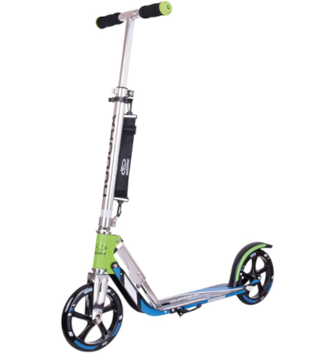

Title:Choix de trotinette
Date: 2023-09-25 18:49
Category:Inclassable
Tags:quantique
Authors: Anthony Le Goff
Summary:

Cela fait un petit moment que je cherche des moyens de locomotion urbain sur Brest. Normalement je devais aller travailler chez Cap Gemini, j'avais 7,5km à faire pour aller au travail, et donc la déserte de bus était pas idéal, je mettais renseigner pour acheter un vélo pliable. J'ai toujours l'intention d'en acheté au cas.

Maintenant je voulais quelques choses de plus pratique qui me permet de coupler avec le bus et tram sur Brest métropole, et donc la trotinette est plus adapté. J'ai comparé les modèles de trotinette et j'ai fais mon choix:

**HUDORA Big Wheel 205 à 89€** Un bon rapport qualité prix [que l'on trouve sur Amazon](https://www.amazon.fr/gp/product/B00F7842X6/ref=ppx_yo_dt_b_asin_title_o00_s00?ie=UTF8&th=1), et mettre plus de 150€ dans une trotinette est une abomination, je suis pas très riche et économe. Elle a de nombreux avantages:



```text

Rapidement arrivé et toujours par le chemin le plus court, ce sont les avantages de rouler en trottinette.

Avec la Big Wheel RX-Pro 205 on est très bien équipé pour se promener dans la jungle urbaine.

Grâce à son pliage Heavy Duty et à sa bandoulière ajustable elle peut se porter par-dessus l'épaule.

C'est surtout un avantage pour les personnes qui souhaitent changer de moyen de transport pour aller au travail ou à l'école. Car ainsi on arrive vite à sa voiture ou sur la route et la Big Wheel se replie rapidement à l'arrivée.

La trottinette n'est pas seulement pliable mais est aussi très flexible dans son réglage : guidon réglable en hauteur de 79 à 104 cm.

La béquille intégrée est pratique pour tous ceux qui font plusieurs arrêts à la suite comme pour faire des courses ou rencontrer des amis pour des courses de trottinettes.

La planche XL-Pro Low Rider de la trottinette est équipée bien confortablement.

La planche large garantit une tenue confortable et sûre.

La trottinette se conduit très facilement grâce à la planche très basse.

Les roulettes High-Rebound en PU moulé sont durables et très confortables pour tous ceux qui aiment rouler vite.

Le roulement à billes chromé ABEC 5 silencieux et le poids léger 4kg de la trottinette en aluminium de haute qualité jouent aussi un rôle important en matière de vitesse.

Le garde-boue large intégré maintient la trottinette propre malgré tout le plaisir à rouler. On peut alors bien prendre de la vitesse.

Les réflecteurs sur la planche et le guidon offrent une sécurité supplémentaire. Ils garantissent une bonne visibilité de la trottinette même dans l'obscurité.

Frein à friction intuitif.
```

Elle va me servir en particulier à aller à mon club d'informatique Linux à Brest le vendredi soir. J'ai 15min de tram et normalement 15 min à pieds ensuite. Cela va me permettre de réduire le temps de trajet à pieds qui est pénible. Si il pleut c'est un plus. 