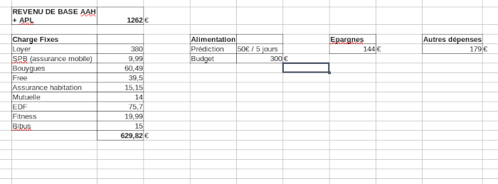

Title:Le compte n'y ai pas
Date: 2023-11-07 13:53
Category:Inclassable
Tags:banque
Authors: Anthony Le Goff
Summary:

J'ai un léger problème sur mon compte bancaire, je vérifie scrupuleusement mon argent car j'ai un petit budget, mais je suis très peu dépensier, mes gros achats ont été surtout des livres, matos de rando et serveurs.

J'avais remarqué le mois dernier que mon compte courant en banque c'est vidé un peu plus vite que d'habitude et j'ai du vérifier s'il n'y a pas une erreur. Le mois dernier j'ai eu très peu de frais à part pour l'escalade (matos + abo) = 300€. Et j'ai eu un trou dans mon budget alors que j'ai fais un virement depuis mon épargne de 300€. J'étais à un moment à 1400€ sur mon compte courant, puis je suis tombé à 600€ en très peu de temps quand j'ai vérifié mes comptes après avoir encaissé le matos d'escalade. 

Aujourd'hui je suis retourné sur mon compte bancaire, et le site bug au CMB, plein d'erreur d'affichage, j'ai tenté de visualiser mon budget du mois dernier en détail, et il m'indique hors charges fixes une dépense de 850€... Alors je suis en train de tout recompter et vérifier chaques dépenses et rentrer d'argent mais le site est buggué. Pour voir d'ou sort ces dépenses qui sont pas indiqué sur le relevé.

Petite idée habituellement comment est réparti mes revenus habitant en ville seul en appartement. Je peux normalement économiser jusqu'à 300€ par mois si je n'ai que des dépenses alimentaires. Mais généralement dans mon mois j'achète un ou deux livres, et va au resto au moins deux fois pour 20€. Comme je dis je suis plutôt clean niveau dépense et relativement modeste. Pour dire quand j'ai commencé à recevoir l'AAH et que j'ai été virer de la banque BNP, il me restait 1900€ d'économie, j'ai atteinds 3 ans plus tard 7000€ d'économie avant d'avoir de grosse dépense.

Malheureusement j'ai le présentiment et l'intuition que l'on veut me mettre sur la paille pour réduire mon impact en particulier mes projets d'entreprise. Car j'ai été dans la précarité et SDF quelques temps avant d'être "protégée" par la maladie mentale et le diag

Que l'on veut contrôler mes dépenses et me mettre sous curatelle, c'est une stratégie en cas de trop de dépense et la mauvaise gestion d'un budget. Beaucoup de gens sous l'AAH sont sur curatelle, et fond n'importe quoi avec leur argent.  

Ce que j'ai peur c'est des frais caché, en gros quand j'ai une grosse dépense, le montant suite à un bug exploité de la banque multiplie par x2,5 . C'est à dire mes 300€ d'escalade deviennne d'un coup 600€. Donc je vérifie tous ça. 