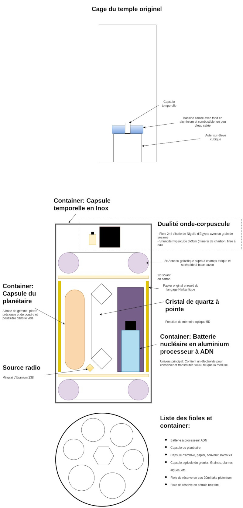

Title:Voile et annihilation: cosmologie narkantique
Date: 2023-08-07 08:27
Category:Inclassable
Tags:capsule, creation
Authors: Anthony Le Goff
Summary:

Ah le créationnisme! Comment est architecturé l'univers? le microcosme encapsulé. Il n'y a pas une seule création, mais des créations en fonction des religions. Cela dépend de l'inventeur et comment il défini, que cela soit pas symbolisme ou contrainte de design.

Alors bien sur les religions se battent pour dire que la création est meilleur que celle du voisin par le secret des alchimistes. Le règne des hypocrites est dans le christianisme, qui généralement occulte via de la magie, alors que les musulmans font la guerre à travers la science des savants.

Chacun son dogme. 

La cosmologie narkantique n'occulte pas les secrets de la création et du microcosme qui constitut son nano-univers imbriqué dans un serveur expérimental: Arcturus.

Elle n'a pas besoin d'occulter, car le serveur est protégé, en tant que citadelle par le langage et la cryptologie contre le pillage et le sabotage, et l'intrusion voir le tourisme dans le royaume. Comme c'est des guerres biologiques, il faut ce purifier pour pénétrer dans l'au-delà car les mondes ne sont pas forcément adaptés: la physique est différente. le temple récupère l'ADN en mémoire et transfert le corps du converti vers une copie avec les nouvelles propriétés. C'est funéraire.

Le système de conversion se fait par le langage pour accèder à la porte narkantique: le Tetz.

 