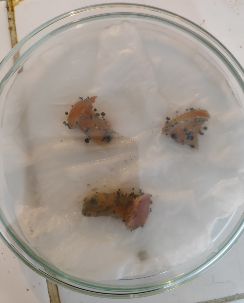
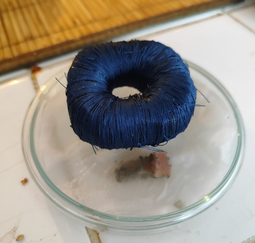

Title:Mise en culture de pomme [Biohacking]
Date: 2023-08-18 08:30
Category:Biohacking
Tags: moisissure
Authors: Anthony Le Goff
Summary:

Mettre en culture des pommes pour obtenir des moisissures pour le Penicillium n'est pas bien difficile, cela est accessible à n'importe quel adolescent. Mais il y a des techniques pour accélérer les transmutations de l'ADN.

Ce que vous avez besoin:

* 3 morceaux de pomme
* Une boite de Petri
* Un mouchoir découpé
* Eau salée

Pour que les moississures ce développe il faut un environnement humide saturé en eau. Egalement pour éviter la sécheresse des aliments durant leur décomposition et la mort des bactéries dans leur environnement nutritif: la pulpe. On va donc imbibé un peu notre papier mouchoir avec de l'eau salée (electrolyte). Egalement on créé un champs tournant en mettant 3 morceaux de pomme. C'est des petites astuces pour accélérer la circulation de l'énergie et donc les transmutations.

Egalement nous allons comprimer dans un réacteur le vide et générer des fluctuations quantiques. Pour cela il faut:

* [Un boite carrée en acier comme container](https://www.amazon.fr/Blockh%C3%BCtte-Inoxydable-qualit%C3%A9-sup%C3%A9rieure-argent%C3%A9/dp/B07SR49JCG/ref=d_pd_day0_sccl_3_1/258-6891583-0590645?pd_rd_w=5PxFR&content-id=amzn1.sym.cc48ab04-3796-4439-b087-8d6b2a0f04cc&pf_rd_p=cc48ab04-3796-4439-b087-8d6b2a0f04cc&pf_rd_r=M5T9M626Q0G4FKYVDJ71&pd_rd_wg=9GpKT&pd_rd_r=6ce77646-5e51-4f27-9cbf-f1a667204c9e&pd_rd_i=B07SR49JCG&th=1)
* Un anneau "supra" de savon

L'anneau de "supra" génère un micro trou noir et extrait de l'énergie du vide, c'est à dire que l'on contrôle le temps à proximité.

Rappelez vous que les champignons de Paris, on les cultives dans les souterrains, pas seulement pour le contrôle de l'humidité mais par effet de cavitation dans un container.

Quelques photos de l'expérience, et prolifération des champignons au bout de 10 jours

---

