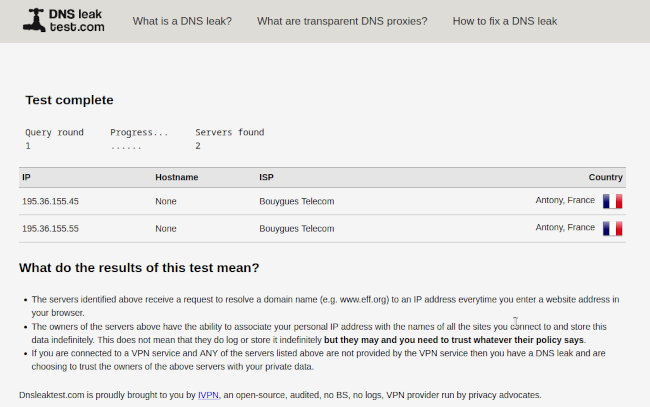
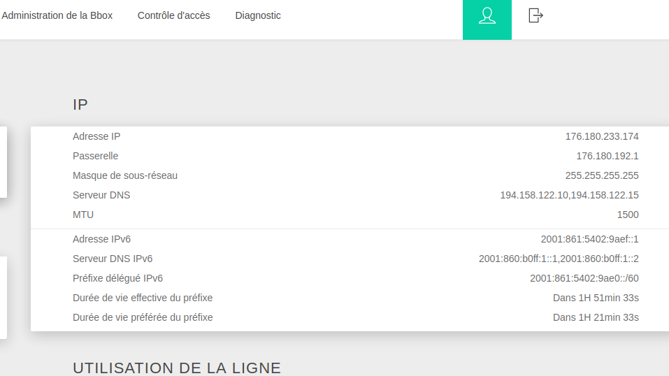
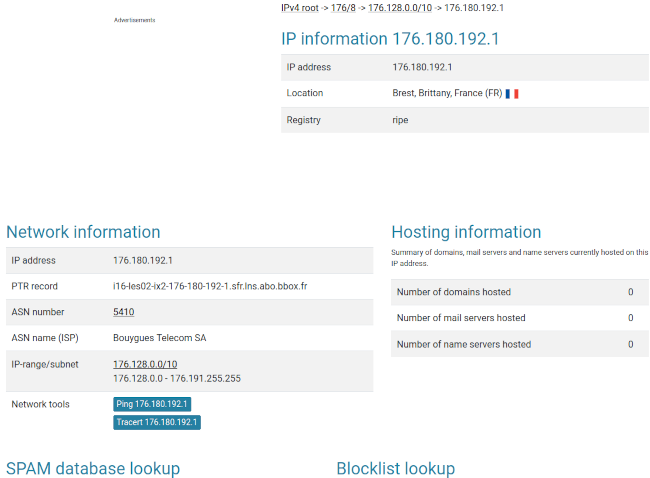

Title:Cyberattaque, et ça continue, encore et encore
Date: 2023-08-29 20:41
Category:Inclassable
Tags:cyberattaque, bouygues
Authors: Anthony Le Goff
Summary:

Il Mossoul un peu, depuis les socialistes et la création du délit "entreprise individuel terroriste" sous le garde des sceaux quimperois Urvoas, on peut plus entreprendre tranquillement dans ce pays. Et moi je dois mettre en place mon réseau local, configuré un routeur NETGEAR Nighthawk et mettre en place des services via mon serveur Proxmox en auto-hébergé.

Mon gros projet est de disrupt le milieu de la CAO (conception assisté par Ordinateur) et par la même occasion dégommé Dassault Systèmes du marché. Donc j'ai commencé à documenter le projet [Qasari sur Codeberg](https://codeberg.org/legoffant/qasari/src/branch/main/ref-docs.md). Il me faut donc des développeurs et ingénieurs travaillant dessus et mettre en place une équipe projet. 

On me met plus que des batons dans les roues, mais je suis tenace, une plaie d'Egypte, un fléau. 

Donc c'est toujours le foutoir sur mon réseau et le routeur de la Bbox depuis la cyberattaque du 22 juillet 2023. Mais vu que certain pensent être très malin, je paye un scandale et fait de la mauvaise pubs chez Bouygues, client insatisfait du service du FAI. Je suis passé un cran en plus, histoire de buzzer et foutre la merde en envoyant un courrier au procureur de Brest en recommandé et dépôt de plainte avec en lien les preuves, logs de la cyberattaque, les raisons et mon adresse de Blog ou je documente.

Si ça bouge pas, et pas d'enquête, faudra penser à bruler l'Etat français. Tout cramer. Nique la police si nécessaire qui défend pas les petits entrepreneurs contre les gros prédateurs. De toutes façons il y a que des homosexuels à la DGSI, dans le contre espionnage ils ont une aversion pour les islamistes.

Mais ça joue au gouvernement, en ce moment cela fait un scandale avec Gabriel et l'Abayas, ce crétin est une symétrie de l'archange dans le Coran.

Cela m'amuse beaucoup en réalité à quelle point c'est des amateurs pour la cyberattaque. Déja on s'amuse bien chez Bouygues qui changent ces DNS et pointe vers la ville d'Antony. C'est gentil on pense à moi.

Mais il y a mieux, je suis en train de faire un scandale au service client de chez Bouygues en ce moment contre un problème d'accès à l'interface d'administration de la Bbox, le routeur. Et ils ont du mal à me croire. 

J'ai prévenu, j'utilise parfois des DNS différents que Bouygues tel que Cloudflare et donc shunte l'accès à l'adresse locale du routeur. Il a fallut que je reset la Bbox, déconnecte de la fibre internet pour vérifier que je me fais prendre par une attaque de phishing. Et bingo....

Donc j'ai bien accès à `192.168.1.254` depuis mon ordinateur local en ethernet sur la Bbox quand je reset le routeur en utilisant les DNS Bouygues, qui me demande un nouveau mot de passe admin. Puis je reconnecte internet, et la voila le foutoir!

La passerelle par défaut change, elle n'est plus locale mais **externe** sur l'IP et localisé à Brest.... Elle est listé comme SPAM. Toujours des tentatives de phishing. Alors je continus mon scandale chez Bouygues. Bande de vandale.

---

