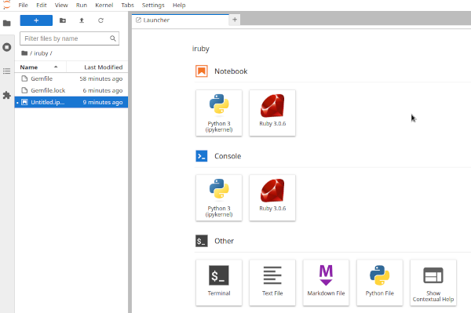

Title:Datascience avec Ruby
Date: 2023-08-29 09:09
Category:Inclassable
Tags:ruby, datascience
Authors: Anthony Le Goff
Summary:

Ruby est un puissant langage comparable au python, et si des fonctionnalités ne sont pas disponible dans celui-ci c'est un manque de volonté de la communauté et des dévéloppeurs pour fournir des librairies. Python est très utilisé en Machine Learning et Datascience, quand est-il de Ruby? Voyons-ça.

Tout d'abord vous pouvez utilisez les **Jupyter Notebook** en Ruby.

Installation des pré-requis
```bash
$ sudo pacman -S libtool libffi ruby python python-pipx
$ pipx install jupyterlab ipython

$ gem install --user-install iruby rspec ffi-rzmq
$ iruby register --force
```

Ajout d'un Gemfile dans notre dossier root de projet:
```bash
$ mkdir ~/iruby
$ bundle init
$ nvim Gemfile

source 'https://rubygems.org'

gem 'rspec'
gem 'iruby'
gem 'ffi-rzmq'
```

Commande pour lancer les notebooks:
```
$ jupyter-lab
```

Vous devez normalement avoir accès au Kernel iruby dans Jupyter:



Si vous avez des problèmes pour localiser la Gems iruby, vérifier votre PATH avec:
```bash
which iruby
```
On pourra egalement vous demander de mettre à jour votre PATH dans bash ou zsh pour pipx et lancer en ligne de commande Jupyter.


Si j'ai du temps et un peu de volonté je vais faire une version française d'une série de Jupyter Notebooks pour apprendre la programmation en langage Ruby comme concatenation:

* [Ruby Notebooks](https://github.com/cdalvaro/ruby-notebooks)
* [Learn Ruby The Hard Way](https://learnrubythehardway.org/book/)
* [Aide Mémoire Ruby](https://xitog.github.io/dgx/informatique/ruby.html)

Pour plus de détails sur les librairies en datascience et ML: [http://ruby-data.org/](http://ruby-data.org/)

### Environnement Datascience

Pour avoir un environnement datascience basic en Ruby je recommande d'utiliser:

* NMatrix: A Versatile Numerical Computing Library
* Daru: Data Analysis and Visualization in Ruby
* Statsample: Statistical Analysis Made Easy
* Rubyvis: Interactive Data Visualization
* SymEngine: Fast Symbolic Manipulation CAS


