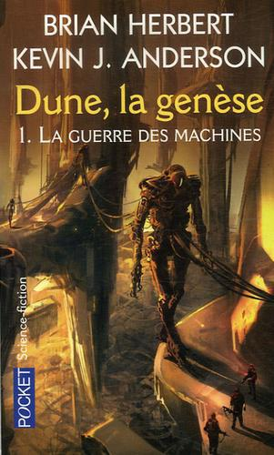

Title:Lecture du moment: Dune - la genèse: la guerre des machines
Date: 2023-08-05 20:59
Category:Inclassable
Tags:dune
Authors: Anthony Le Goff
Summary:

Je partage mes lectures du moment, même si je prends un peu moins de temps pour lire durant mes activités, je fais du data mining. En gros je blog, fait un peu de science et de la lecture au calme au studio avec parfois des marches dans Brest.

Un livre très intéressant et l'évasion des Atréides de la planète Terre sur le vaisseau "Le Voyageur de Rêve".

Synopsis:

```
Dix millénaires avant les événements relatés dans Dune, l'humanité se trouve soumise à la tyrannie des Machines Intelligentes. Imprudemment, lors de leur expansion dans la Galaxie, les sociétés humaines ont confié de plus en plus de responsabilités à leurs ordinateurs. Ceux-ci ont formé un réseau et son élément le plus puissant, OMNIUS, s'est emparé du pouvoir, profitant de la stagnation de l'insouciante civilisation humaine. En réaction, certains humains ont choisi de greffer leur cerveau sur des machines, devenant des cyborgs ou des cymeks, virtuellement immortels. Ils se sont baptisés eux-mêmes les Titans. Enfin, une poignée d'humains rebelles a créé la Ligue des Nobles pour secouer le joug d'OMNIUS et celui, à peine plus supportable, des Titans. Ainsi va éclater la Guerre des Machines, qui sera connue plus tard sous le nom de Jihad Butlérien et qui mènera à l'interdiction absolue de la création de machines à l'image de l'intelligence humaine. C'est alors que naissent les Grandes Familles, les Ordres comme celui, féminin, du Bene Gesserit, ou masculins, des Mentats et des Docteurs Suk, et les puissances obscures comme celle du Bene Tleilax, qui seront, dix mille ans plus tard, les protagonistes de Dune et de ses suites. Voici la Genèse de Dune.
```




Alors vous pouvez lier ce roman SF et les containers qui héberge l'esprit des Titans comme hébergeur des machines.