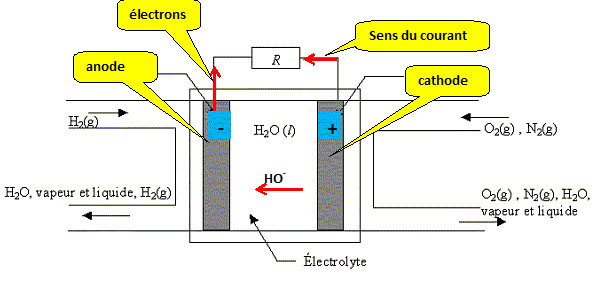
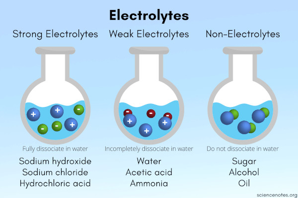
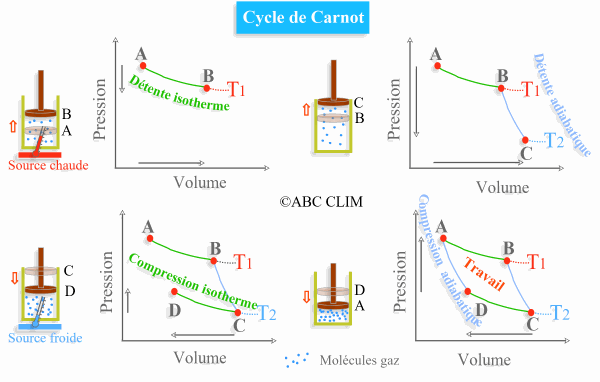

Title:L'électrolyte [biohacking]
Date: 2023-08-01 10:01
Category:Biohacking
Tags:electrolyte
Authors: Anthony Le Goff
Summary:

Pour le processeur à ADN on ce penche sur la conception de la fiole à ADN et l'électrolyte (assimilable au cytoplasme). Qui est un principe des piles électriques et batteries. On apprend très jeune au collège, la pile Volta. C'est une expérience de physique chimie avec généralement un citron (électrolyte) et du zinc et du cuivre (anode et cathode). Rappel que les alchimistes: c'est alimentaire. On peut mesurer un courant avec un amperemetre. *Vous n'avez pas les bases en ingénierie et la production énergétique*. 

La question de créer un électrolyte performant pour catalyser des réactions et condenser l'énergie doit être quantifié, une question de dosage. Il y a une tolérance, en fonction de l'optimisation des performances de la batterie.

Ainsi mon dosage personnel:

* 66% d'eau dopé au sel aromatique Herbamare (à saturation)
* 22% Liquide de vaiselle Clean Mrs.Meyer's, huile essentielle, citronnée, glycérine
* 4% d'éthanol via du parfum de haute qualité

Sous forme de traces de 1 à 8%

* de l'ADN
* Huile, vinaigrette
* Lithium
* Du sucre (glucose) tel que la gelée royale
* Faire la synthèse des protéines pour l'ADN.
* Des poudres et épices, rendre opaque: dans l'obscurité que ce produit la création, tel que dans les abysses et les fumeurs noirs.

Prenez note:

* Le choix de l'eau minérale (Vittel), il faut qu'elle soit nitrée (un petit peu) pour assembler des molécules de Nitroglycérine (TNT)
* Les batteries modernes sont du Li-ion. On dope avec de l'hydroxyde de lithium sous forme de trace. Si vous ajoutez des enzymes, levures et spores via du Penicillium, elles vont travailler pour catalyser la fusion nucléaire D+T à froid. L'eau lourde, le deuterium est sous forme de trace dans l'eau, un isotope de l'hydrogène.
* Pour créer la réaction nucléaire, il faut une capture neutronique dans le réacteur, possible via des neutrons cosmiques, des pulsars, des quasars, des supernovas, mais également de l'uranium 238.
* La mousse du liquide vaisselle permet de mettre sous pression hermétique la fiole: c'est un principe de thermodynamique du cycle de Carnot. Il faut donc secouer la fiole durant quelques minutes, et c'est cyclique, il faut le faire plusieurs fois pour faire démarrer le moteur, jusqu'à un régime établi et asservissement en automatique de puissance.

