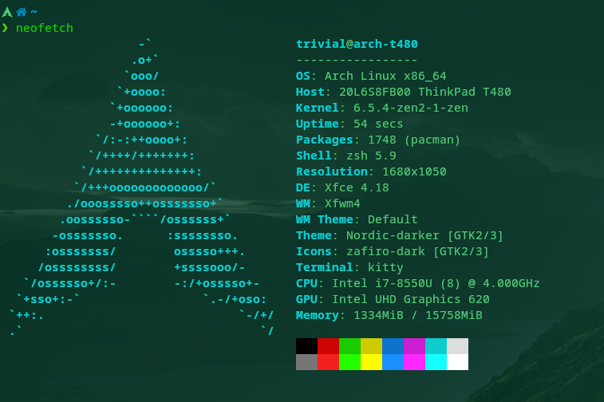

Title:Débat et choix d'environnement de bureau
Date: 2023-09-24 19:57
Category:Inclassable
Tags:bureau
Authors: Anthony Le Goff
Summary:

Il y a un large débat dans la communauté sous Linux du choix d'environnement de bureau, et il y a en pour tous les goûts et couleurs. Personnellement je préfère les environnements robustes et légers qui ont fait leur preuve pour optimiser la productivité. Je suis pas contre l'innovation, et j'intègre des briques logiciels nouvelles même dans mon ordinateur de travail en production. Mais je me méfie de l'innovation de rupture qui n'est pas au point et complètement buggué. 

Voici en résumé se que j'utilise comme environnement de travail personnel:

* Arch Linux kernel Zen
* Shell: Zsh
* Environnement de bureau: XFCE
* Terminal: Kitty
* Launcher: Sinapse

En faite c'est un compromis entre des innovations et des environnements robustes. J'utilise XCFE car j'aime l'intégration de la barre des tâches, les icones et l'utilisation de Thunar qui simplifie la gestion réseau de mon NAS avec Samba. J'utilise toujours Sinapse et le moteur Zeitgeist qui est un projet à l'abandon, je devrais switcher sur [Albert](https://albertlauncher.github.io/) mais pour l'instant il fait le job. Malgré que j'ai essayé le shell Fish. J'ai eu des problèmes d'incompatibilité avec des scripts shells qui m'ont donnée de l'urticaire, donc j'ai abandonnée. Sur le principe Fish est intéressant, mais il a voulu se démarquer de Zsh, en innovant trop en faisant son propre système de script qui pose un problème d'interroperabilité. Une erreur de débutant de trop vouloir ce démarquer et donc réduire l'adoption des innovations. 

Ce qui m'intéresse est l'adoption de Wayland à la place de X.org. Pour l'instant ce n'est pas au point et cela reste des "early adopter" qui adopte la technologie. Très peu de distribution l'on adopté généralement depuis 2021. C'est tout neuf. Dans les compositors sous Wayland on note Sway et Hyprland. Je m'intéresse à [Hyprland](https://hyprland.org/) et basculer dessus, mais j'ai peur de perdre trop d'outil de XFCE. Hyprland est très jeune, il est sortie, la première release en mai 2022. Il y aucune distribution en native sous Hyprland, c'est vraiment pour les connaisseurs de la customisation sous Linux. C'est un cercle très fermé pour l'instant. 