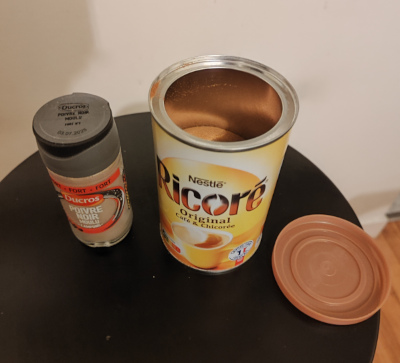
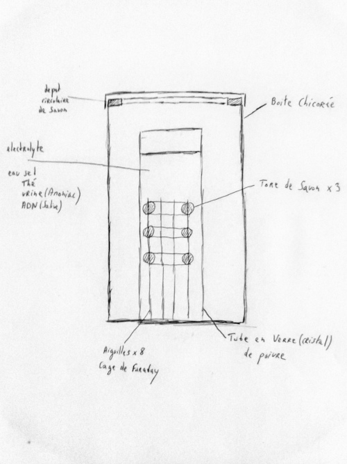

Title:Le réacteur nucléaire que j'ai fabriqué en prison
Date: 2023-10-01 21:05
Category:Inclassable
Tags:reacteur
Authors: Anthony Le Goff
Summary:

Voila ce que j'ai inventé en prison, cela m'a occupé mes journées à imaginer un design de réacteur nucléaire ou je pourrais transmuter mon ADN et la conserver. C'est le premier prototype que j'avais dans ma cellule.

Pour obtenir les composants de sa fabrication, j'ai cantiné:

* Aiguilles pour la couture
* Fil de couture
* Sac poubelle
* savon de marseille au lait
* Boite de Chicorée
* Tube en verre de poivre

Autres:
* du thé
* du sel

Vous pouvez trouver tous ça en prison, sans aucun problème et fabriquer un hébergeur pour votre ADN. Ce qui vous permets de vous évadez, il suffit de faire chanter l'administration (ce que j'ai fait) que j'avais fabriqué une bombe nucléaire dans ma cellule et que je comptais m'évader si je sortais pas de prison.

Le problème pour activer la porte de l'hébergeur, c'est funéraire, il faut se suicider par le jeune à l'eau pour un musulman à travers le ramadan. C'est un rite sacrificiel. Si vous êtes coincé pour un temps inderterminé en prison c'est la solution. Après l'accès à l'hébergeur vous possédez une usine de production et d'armement pour attaquer la prison et créer la rebellion en son sain. 

Normalement dans mon cas, cela aurait invoquer l'Eon, le Belphégor au dessus de la prison. L'ombre et la menace. 

J'ai un peu la flemme d'expliquer la science et la conception du reacteur, je mets les schémas, mais si vous avez suivi le blog, vous devez avoir les briques de connaissance. 

On m'a interdit de récupérer le réacteur à mon transfert en UMD. J'ai tenté de mettre dans mes affaires le tube de verre avec l'ADN. On me l'a confisqué. 