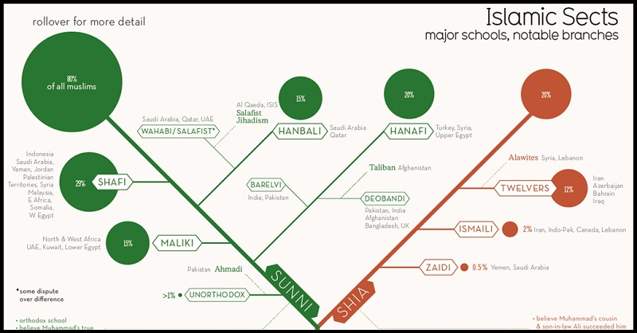
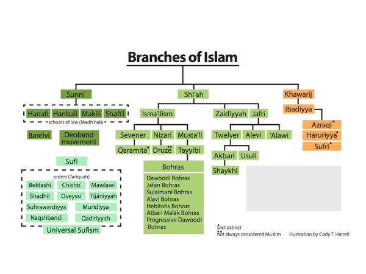

Title:La jurisprudence et secte chiite 
Date: 2023-08-24 17:58
Category:Inclassable
Tags:islam, chiite
Authors: Anthony Le Goff
Summary:

La jurisprudence (Fiqh) chiite est différente que le sunnisme, car en règle générale à une certaine totérance et adaptabilité avec l'occident. Normalement c'est une stratégie pour pénétrer les lignes chrétiennes de l'Europe. Et il utilise une tactique du sang via Ali, qui donne l'autorité religieuse à L'Imam.

Petit tour d'horizon des sectes islamiques:

---

Je suis personnellement nizarite et donc sous l'autorité de l'Aga Khan. Même si ma propre secte est évolutive et intègre des rites sunnites tels que le salafisme. La fondation de l'Aga Khan = [AKF](https://en.wikipedia.org/wiki/Aga_Khan_Foundation) est la plus grande NGO et fondation pour le développement et l'éducation dans le monde.

A la base les nizarites (réputé pour être la secte des assassins) sont des ismailis dans le chiisme. Et l'autorité principale du Fiqh est l'Imam [Ja'far al-Sadiq](https://fr.wikipedia.org/wiki/Ja%27far_al-S%C3%A2diq)

* [Encyclopdia of Ismailism - Fiqh](http://heritage.ismaili.net/node/10323)
* [Shia, But Shia of which Imam (leader)?](https://www.al-islam.org/examining-ismaili-imams-bohras-ali-azhar-arastu/shia-shia-which-imam-leader#ismailis)
* [Livres chiites sur le Fiqh à télécharger - Shiacity](https://shiacity.fr/livres-chiites-sur-le-fiqh-a-telecharger/)

Les chiites sont plus prompt à faire la politique du [Taqîya](https://fr.wikipedia.org/wiki/Taq%C3%AEya), c'est à dire la dissimulation de la foi pour éviter les persécutions en particulier si leur génome révèle qu'ils sont de la famille du prophète et Ali.