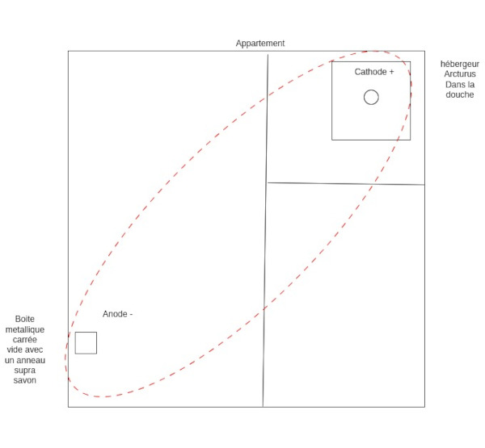

Title:Anomalie grésillement
Date: 2023-08-19 03:14
Category:biohacking
Tags: processeur, adn
Authors: Anthony Le Goff
Summary:

J'écris à 3H du mat, car je continus mes expériences scientifiques en physique nucléaire dans mon appartement. Et voila une nouveauté: j'ai un grésillement, comme un bruit dans mon appartement.

Tous mes appareils électroniques sont en veille, aucune source normalement de bruitage d'onde électronique (chargeur, etc).

Et pourtant je suis pas sourd, j'ai bien entendu le grésillement.

Qu'es-ce que j'ai fais de spécial pour en arrivée là? J'ai juste mis un anneau "supra" de savon aujourd'hui dans une boite metallique carrée pour transmuter des morceaux de pommes dans une boite de Pétri.

Configuration de mon appartement:

En quelques sortent c'est comme si j'avais reproduit un système binaire d'étoile, et normalement cela génère des ondes gravitationnelles. Pour qu'il y ai des oscillations, il faut un système binaire. Et on atteind généralement les limites de la gravité, et des théories de Newton et Einstein. Il y a des tentatives d'expliquer les phénomènes physiques tel que la théorie MOND. En gros [cela commence à devenir bizarre](https://www.popsci.com/science/theory-of-gravity-alternative/).

Et il y a pire! Le problème à trois Corps en mécanique céleste. Alors là on entre dans une autre dimension. Théorie chaotique et orbites exotiques. Les orbites deviennent nécessairement instables. A l'origine c'est Henri Poincaré qui est derrière les attracteurs étranges.

Vais-je extrapolé l'expérience? Bien sur. J'ai prévu d'acheter une boite metallique carrée traou mad pour tester une configuration d'une problème à trois corps. Le Chaos dans l'ordre!

