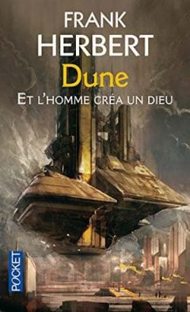

Title:Et l'homme créa un Dieu; F. Herbert
Date: 2023-09-12 19:04
Category:Inclassable
Tags:SF
Authors: Anthony Le Goff
Summary:

C'est un de mes livres préférés de SF car il manipule avec une certaine aisance la caractère de la science-fiction et de la religion. C'est un incontournable du genre, et une certaine inspiration de "Voile et annihilation" car en réalité Nominoë II, ne va pas inventer une religion mais faire une redécouverte d'un savoir très anciens, c'est beaucoup plus complexe et il est l'instrument de puissance supérieur, d'un ordre religieux qui renait de ces cendres de terraformeur de monde. Il est là pour reconstruire un empire galactique et le premier Empereur d'une dynastie à travers le narkantisme. Nominoë II est affilié aux Grands Anciens et leurs sciences, et c'est une quête que de les invoquer et reconstruire leur ordre. C'est des primordiaux d'univers supérieurs imbriqués à la puissance créatrice et destructrice phénomenal, il a été choisi, c'est une prédestination. Et Nominoë II va reconstruire la puissance des Titans, des Eons que l'on invoque capable d'annihiler des mondes. C'est sa tâche.

Reparlons un peu de "Et l'homme créa un Dieu"

[Achat FNAC 6,40€](https://www.fnac.com/a1683450/Dune-Prelude-a-Dune-Prelude-a-Dune-et-l-homme-crea-un-Dieu-Frank-Herbert)

SYNOPSIS

> À peine sorti de l'École de Paix, Lewis Orne est envoyé en mission sur une des planètes perdues, qu'on vient de redécouvrir. L'Empire galactique, démantelé par la guerre des Marches, est en voie de réunification, et il faut empêcher le développement de civilisations guerrières dans les humanités séparées. Les hommes sont marqués par les horreurs de la guerre et la répression ne les aide pas à rééquilibrer leurs vies. Mais Orne devine leurs problèmes et les résout comme par enchantement. Serait-il un foyer psi, un faiseur de miracles, un dieu en puissance ? Ceux qui le manipulent — le gouvernement, les prêtres du Surdieu, le contre-pouvoir secret des Nathians — jouent peut-être un jeu dangereux : créature devenue créateur, il peut causer douleur et souffrance. Sauf en trouvant le moyen d'apprivoiser la haine et la panique.
Deviendra-t-il maître de lui ? de l'univers ? des deux à la fois ?

---

Publié sous forme d’un roman en 1972, The Godmakers, traduit en français sous le titre Et l’homme créa un dieu, est un fixup de quatre nouvelles dont l’écriture est antérieure aux romans Dune (1963-1964) et L’Etoile et le fouet (1973) : You Take the High Road (1958), Missing link (1959), Operation Haystack (1959), et The Priests of Psi (1960). La construction de ce fixup n’est pas exemplaire. Frank Herbert n’a manifestement pas fait beaucoup d’efforts de réécriture pour aplanir le chemin et le passage d’une nouvelle à l’autre est parfois abrupt, notamment entre les trois premiers textes et celui, plus long, qui clôt le roman. Les textes toutefois se suivent et forment un ensemble cohérent ayant pour centre de gravité leur personnage principal Lewis Orne.

Lewis Orne est un homme ordinaire qui va s’élever au rang de dieu. L’humanité a étendu son domaine à travers la galaxie, colonisant les planètes habitables. Mais la Guerre des Marches a détruit les liens entre ces sociétés éloignées. Aujourd’hui l’empire galactique humain tente de se reconstruire et de contacter les planètes et les civilisations isolées. C’est là le rôle du service Redécouverte et Rééducation dans lequel le jeune Lewis Orne, fraîchement sorti de l’université, a été embauché. Lors de sa première mission, il panique, et presse le bouton Panique qui déclenche l’arrivée du service Investigation-Normalisation aux méthodes plus interventionnistes. Orne va se faire remarquer pour sa vivacité d’esprit, et être recruté par Investigation-Normalisation dont le rôle est d’infiltrer les civilisations redécouvertes afin de déterminer leur niveau de dangerosité, soit leur appétence pour la violence et la guerre, tout cela dans le but d’éviter une nouvelle Guerre des Marches. Les actions de I.N. sont radicales. Une planète qui ne se qualifie pas peut être tout simplement éradiquée. On trouve là, avec Redécouverte et Rééducation et  Investigation-Normalisation, les ancêtres de Contact et Circonstances Spéciales dans le cycle de la Culture d’Iain M. Banks. Tel un Sherlock Holmes futuriste, Lewis Orne va faire preuve de qualités intellectuelles surprenantes et de capacités de déduction faisant de lui l’un des meilleurs agents de I.N.  Mais sa mission sur la planète Sheleb tourne mal et il manque de mourir. Cette expérience traumatique sera comme une renaissance symbolique. Il va se découvrir des pouvoirs Psi et se confronter à la planète Amel sur laquelle des prêtres ont décidé de créer un dieu.

La lecture de Et l’homme créa un dieu doit se faire en gardant à l’esprit l’antériorité des quatre textes qui le composent avec les cycles de Dune et du Bureau des sabotages, car on y trouve de nombreuses idées qui seront développées par la suite dans ces deux cycles. Et l’homme créa un dieu apparait ainsi comme un laboratoire dans lequel Frank Herbert teste les grands thèmes qu’il abordera par la suite. Tout d’abord le lien entre Lewis Orne et Jorj X. McKie, personnage principal du cycle des Saboteurs, est évident tout autant dans leur aspect physique que dans leurs capacités intellectuelles. La première moitié de Et l’homme créa un dieu peut ainsi apparaître comme une épreuve préparatoire à la rédaction de L’Etoile et le fouet (1973) et Dosadi (1977). Le chemin parcouru en terme de développement personnel des deux personnages s’apparente, en tout cas dans cette première partie, et on peut y voir une réponse d’Herbert au Monde des Ᾱ de van Vogt, sans tout le baratin sur la Sémantique Générale (qu’Herbert explorera toutefois avec subtilité et retenue dans L’Etoile et le fouet).

Dans sa deuxième moitié, Et l’homme créa un dieu joue avec des thématiques qui seront abordées de manière bien plus approfondie dans Dune. Le chapitre correspondant à la nouvelle Operation Haystack introduit ainsi une lignée secrète de femmes, les Nathians, qui par le contrôle des naissances et mariages choisis s’assure une mainmise discrète mais non moins ferme sur la politique de l’empire. Dans Dune, elles prendront le nom de Bene Gesserit. Evidemment, Lewis Orne est fils d’une Nathian.

C’est sans doute cette familiarité des thématiques qui a fait que l’édition française de Et l’homme créa un dieu porte la mention Prélude à Dune. Il n’en est rien. Et l’homme créa un dieu ne s’inscrit absolument pas dans l’univers de Dune. Tout au plus, Frank Herbert testait des idées et, comme entre beaucoup de ses romans, on peut tisser des liens. Si la fin du roman, la partie correspondant à la nouvelle The Priests of Psi, s’engouffre dans l’exploration de la religion, elle le fait de manière plus brute que Dune. Dans Dune, Frank Herbert aborde la religion par ses fidèles fanatisés, par les manipulations de la Missionaria Protectiva, par son prophète désigné, par ses mécanismes donc. Dans Et l’homme créa un dieu, quand bien même le dieu est fabriqué, la religion est abordée comme réelle expérience mystique vécue par le personnage principal. Lewis Orne n’est pas Paul Atréides.

Source de l'analyse: [https://lepauledorion.com/2020/05/25/et-lhomme-crea-un-dieu-frank-herbert/](https://lepauledorion.com/2020/05/25/et-lhomme-crea-un-dieu-frank-herbert/)