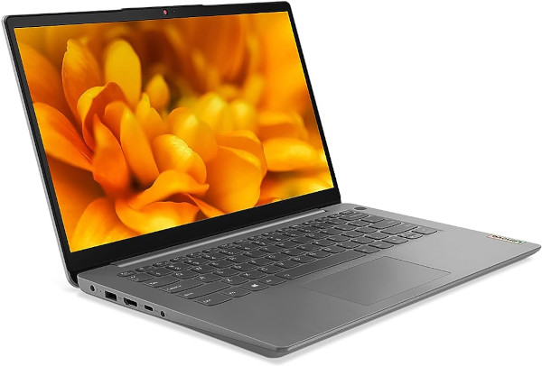

Title: Promo laptop Lenovo Ideapad 3 à 579€
Date: 2023-08-20 07:10
Category:Inclassable
Tags: promo
Authors: Anthony Le Goff
Summary:

C'est bientôt la rentrée, et je check toujours les promotions pour équiper les étudiants dans les grands distributeurs tel que Darty et Fnac. On peut tomber sur de bonnes affaires.

Darty propose une promotion très intéressante sur un Lenovo Ideapad 3. Je préfère les "Thinkpad" mais on ne va pas cracher dessus vu la configuration et le prix. ideapad reste relativement bien compatible sous Linux. Peu de problème à basculer de système d'exploitation.

Comme premier PC en neuf cela reste donc un bon choix, à **579€**, prix incluant une souris et une sacoche dans un Pack. 

Configuration:

* Ecran full HD 14"
* CPU Intel i5 4core @2,5GHz
* RAM 16GB DDR4
* SSD NVMe 512GB
* GPU Intel Iris Xe

Connectique:

	
* 1 USB 2.0
* 1 USB 3.2 Gen1, Type-A
* 1 USB 3.2 type C Gen1
* 1 HDMI 1.4b
* Lecteur de carte mémoire

* Wifi 
* Bluetooth

Lien vers l'offre chez Darty: [PC portable Pack Lenovo Ideapad 3](https://www.darty.com/nav/achat/informatique/ordinateur_portable-portable/portable/lenovo_pck_ip3_14_i5_16_512.html#product_description)

NOTA: Pour le même prix vous pouvez avoir un Thinkpad T570 aux mêmes caractéristiques en reconditionné sur BackMarket. [Lien vers l'offre](https://www.backmarket.fr/fr-fr/p/lenovo-thinkpad-t570-15-core-i5-7300u-260ghz-ghz-ssd-512-go-16384-go/d814005f-4861-4e89-b32b-45e50f8ecfe2#l=11). Ou un ThinkPad T480 14" Core i7 4cores @1,8Ghz (celui que je possède). [Lien vers l'offre](https://www.backmarket.fr/fr-fr/p/lenovo-thinkpad-t480-14-core-i7-18-ghz-ssd-512-go-16-go-azerty-francais/f8184d8c-a9d8-4b1e-a2a4-abfe633caadd#l=12).

