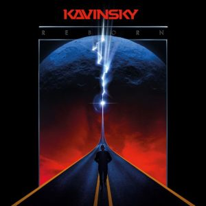

Title: Kavinsky - L'attaque des clones
Date: 2023-07-27 05:16
Category:Inclassable
Tags:clones
Authors: Anthony Le Goff
Summary:

Je vais expliquer un principe essentiel en science de l'information et cryptologie à travers le symbole véhiculé par un signal. L'information se réplique à travers le temps et transmute, elle ne disparait véritablement jamais, en particulier si son impact est importante: *on ne peut pas détruire de l'information.*

Les individus peuvent véhiculer des informations, juste pas leur physique et comportement comme signal de communication, voir des patterns. C'est l'attaque des clones.

Ainsi Richard Stallman, et l'Eglise St-Ignucius est un clone de mon grand-père: Raymond. Célèbre guerre d'Editeur de Texte en informatique entre Vi et Emacs: *"VI VI VI, le chiffre de la bête !" disent les emacsiens de l'Église de Emacs.* Sheri vi?

On peut également parler de Hubert Reeves. L'astrophysicien et conteur qui a écrit entre autre "Poussières d'étoiles" qui n'est autre qu'un clone de Leonard de Vinci.

Parlons de Kavinsky. Lui c'est pas un chanteur, mais un DJ. Il fait de la musique électronique. Tout comme Amélie Lens et la techno underground (RC Lens - Les Corons, le chant des mineurs) vivant à Antwerp. Kavinsky est un clone de Youn, un frère de Raymond. J'écoute pas que du Black Metal pour bruler des Eglises.

Célébrité qui avait une dégénérence au niveau de l'oeil, il avait une DMLA. Kavinsky roule en Ferrari Testarossa. J'ai la particularité d'être né le même jour, un an après la mort de l'industriel Enzo Ferrari un 14 Aout 1989.

En 2022, Kavinsky à sorti un nouvel Album: Reborn. Avec le titre Trigger qui est sympa et stylé, sa tourne en boucle dans ma playlist musical.

[Trigger - Reborn (Audio - Youtube)](https://www.youtube.com/watch?v=9mQ_QvlmY9c)

