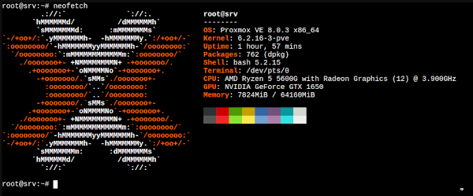

Title:Kor51 en auto-hébergé sur serveur Proxmox
Date: 2023-09-29 07:07
Category:Linux
Tags:proxmox
Authors: Anthony Le Goff
Summary:

Je suis retourné sur mon serveur Proxmox, pour rappel configuration materiel:

```text
###########################################################
Config Server mini-ITX CPU Ryzen 5  64GO RAM 4x2TO HDD RAID
###########################################################
Par ldlc.com

- Carte mère: ASRock A520M-ITX/ac 119€95
- CPU: AMD Ryzen 5 5600G Wraith Stealth 6 cores (12 threads) (3.9 GHz / 4.4 GHz) 157€96
- Boitier: Fractal Design Node 304 Noir 119€95
- RAM: Corsair Vengeance LPX Series Low Profile 64 Go (2x 32 Go) DDR4 3200 MHz CL16 256€95
- HDD: 4 x Seagate IronWolf 2 To 395€80
- Alimentation: be quiet! Straight Power 11 450W 80PLUS Gold  107€95
- Ventirad: Noctua NH-L9a-AM4 59€
- Cable: 2 x Corsair Câbles SATA Gainés Droits/Coudés 30 cm (coloris bleu) 29€90
- Clavier: Advance GTA 230 (AZERTY Français) 19€94
- GPU: Zotac NVIDIA GTX 1650 OC 4GB 180€ 

total: 1440€
```



Alors c'était un peu le souk sur mon réseau local, il a fallut que je change de FAI, mettre un second routeur en DMZ Netgear Nighthawk RAX50 pour protéger mes équipements, et j'ai raison vu la cyberattaque que j'ai subis, j'avais encore des attaques DDoS sur mon IP. J'ai des logs alors que personne à part mon nouveau FAI il y a une semaine savait mon IP Public.... J'ai encore porté-plainte au procureur.

Entre temps mon serveur Proxmox était H.S, impossible de me logguer, il bloquait aux lancements des services au démarrage. Je sais pas pourquoi. J'avais rien dessus, je faisais que des tests, j'ai rien perdu. Donc j'ai tout ré-install et configuré le nouveau mapping de réseau, car j'ai un sous-réseau en 10.0.0.0 pour le Netgear et l'installateur de Proxmox ne reconnait pas en natif le sous-réseau...

Depuis tout est up, j'ai ouvert les ports HTTP et HTTPS du routeur Netgear en DMZ. J'ai configuré une VM sous Debian 12 avec mon site Kor51.org, et je continus mes phases de tests. La bonne nouvelle c'est que le serveur web est up sur mon IP Public à l'adresse: [http://82.64.210.252/](http://82.64.210.252/)

Il me reste à attacher un nom de domaine à l'IP et configurer SSL. Il y a quelques manips à faire dans les fichiers de configurations tels que `/etc/hosts` et celui du site "vhost" sous Nginx pour pointé vers le nom de domaine.

EDIT: [https://kor51.org/](https://kor51.org/) est transféré entièrement en auto-hébergé, domaine OK, SSL OK