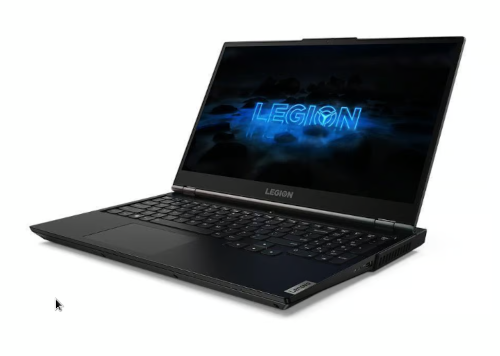

Title:Lenovo Legion 5
Date: 2023-08-15 14:26
Category:Inclassable
Tags: laptop
Authors: Anthony Le Goff
Summary:

J'ai eu une petite cure de rappel de la part d'un collègue sur Brest, Kevin qui a changé son PC portable et à fait le choix d'un PC de Gamer: `Lenovo Legion` pour 800€ en entrée de gamme.

C'est un très bon choix, et je lui est conseillé, il voulait jouer avec des potes à LoL (Leagues Of Legend). Si vous recherchez des PC bon marché de Gamer. Cela serait mon propre choix en meilleur rapport qualité / prix. Il y a également un autre modèle très bon produit que j'ai vu dans mon association d'informatique Linux sur Brest, un jeune ado faisait tourné Ubuntu sur un `Dell G15` dans la même gamme de prix.

Kevin est intéressé pour apprendre un peu la programmation et Linux, mais il est attaché à faire du gaming et donc utilisé Windows 11. Même si LoL est supporté sous Steam Linux. Il a fait un BTS dans l'electrotechnique. Il est un peu frileux d'apprendre à programmer, pense que c'est trop dur. Alors je lui explique mes trucs et astuces, les machines virtuelles Linux sous Virtual Box, ou WSL dans un terminal. 

Si je devais changer de PC pour un laptop de Gamer et upgrader la carte graphique je prendrais surement un Lenovo legion. Mon Thinkpad T480 à 450€ me convient largement car si je veux faire du gaming, je passe via une VM sur mon serveur Proxmox.

**Lenovo Legion 5 15ACH6H** 

* Ecran 15" 
* CPU Ryzen 5 3,3 GHz 
* Disque SSD 512 Go
* RAM 16 Go
* GPU NVIDIA GeForce RTX 3070
* Clavier AZERTY

En reconditionné [chez BackMarket à 1100€](https://www.backmarket.fr/fr-fr/p/lenovo-legion-5-15ach6h-15-ryzen-5-33-ghz-ssd-512-go-16-go-nvidia-geforce-rtx-3070-azerty-francais/d5770e67-f1b2-481b-9c1e-70d88ee7a74f#l=12). On peut le trouver en neuf [chez Amazon à 1555€](https://www.amazon.fr/Lenovo-Ordinateur-Portable-R%C3%A9tro%C3%A9clair%C3%A9-Fran%C3%A7ais/dp/B09S61D3LL)

NOTA: le support des Lenovo Legion 5 est valide sous Arch Linux: [voir Legion Series sur le wiki](https://wiki.archlinux.org/title/Laptop/Lenovo#Legion_series)