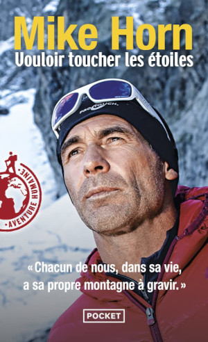
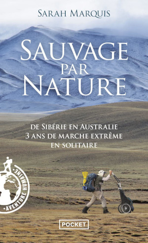

Title:Mes livres de décembre spécial aventure
Date: 2023-12-05 09:56
Category:Inclassable
Tags:trek
Authors: Anthony Le Goff
Summary:

La préparation mentale est primordiale pour espérer parcourir de grande distance en trek, 80% Mental, 20% Physique disait toujours mon entraineur en cyclisme, que j'ai bien gardé comme maxime. Si la tête flanche, alors tout déraille et s'entrainer sert à rien. Il faut attendre et patienter le temps qu'il faut, faire d'autres activités ou tout simplement une retraite spirituelle et prier pour des jours meilleurs. On a le temps, nous vivons dans un monde de l'immédiateté et la compétitivité à outrance qui est une course contre le temps. Certain voit leur jeunesse s'évaporer et pense ne plus pouvoir faire d'exploit sportif après 40 ans. C'est faux, le plus vieux personnage, M.J. "Sunny" Eberhart, qui a parcouru le fameux sentier des Appalaches à 83 ans sur 2000km. Yūichirō Miura, un japonais a gravi l'Everest à 70 ans. 

Pour beaucoup de gens la veillesse est un naufrage. Pour préparer mentalement il faut s'informer et ce mettre en condition à faire des exploits sportif. Ainsi si je veux être capable de faire des sessions de 55km dans 3 ans de trek par jour, je dois avoir une préparation mentale spécifique et être capable de tenir sur 12h d'effort en endurance proche de 5000Kcal de dépense énergétique.

Cela ne se fait pas du jour au lendemain, et on peut partir de rien, la préparation physique est quelque chose qui s'adapte en fonction de l'état de santé de l'individu, même après de longue période de sédentarité ou que l'individu à eu des maladies invalidantes ou blessures sévères. L'humain est très résilient, son corps se répare toujours, mais parfois il faut du temps. Ma mère à mis 15 ans à sortir de son état dépressif, elle en garde des séquelles, mais n'a pas abandonné pour autant et vie malgré tout. Cela reste des leçons de courage à petite échelle face à l'adversité et cela me rappel que tout se répare avec le temps. 

Pendant ma période de rémission je fais de la préparation mentale. Et donc je fais de lecture pour calmer l'esprit et focaliser sur la concentration. Si je lis pas un livre, je lis des blogs sur internet ou des vidéos parfois. Je lis tout le temps. 

Dernièrement j'ai regardé comment Mike Horn se préparait pour ces expéditions dans un vlog. Et cela est inspirant et donne des idées pour ce mettre en condition. Sa spécialité pour faire une mimique du traineau: tirer des pneus sur du dénivelé en Suisse. Alors bien la préparation physique est essentiel dans ce type d'effort ou l'on risque parfois sa vie en cas de défaillance du corps. Et il a eu chaud plusieurs fois dans ces périples. C'est un maitre à pensée de l'aventure et du survilalisme même si on sait qu'il a une assistance en cas de pépin car médiatique. 

Je me suis donc concentrée sur trois livres parmis mes achats de lecture de décembre en aventure, expédition et trek. Avec des auteurs féminins pour une fois. Qui sont des best-sellers dans le domaine. Lire des exploits d'autres personne ou des situations difficile qui font prendre des décisions permet de ce mettre soit même en condition.

### Wild, Cheryl Strayed

"Wild" est un récit de voyage et de découverte de soi écrit par Cheryl Strayed. Voici un résumé général du livre :

**Synopsis :**
"Wild" relate l'histoire vraie de Cheryl Strayed, une femme en crise qui décide de faire face à ses démons en entreprenant un voyage en solitaire sur le Pacific Crest Trail (PCT), un sentier de randonnée de 1 770 kilomètres à travers l'ouest des États-Unis, allant du Mexique au Canada.

**Points Clés :**

1. **Contexte Personnel :** Cheryl Strayed a entrepris ce voyage après avoir traversé une période difficile de sa vie, marquée par le deuil, la dissolution de son mariage et des comportements autodestructeurs.

2. **Le Chemin de l'Autodécouverte :** Le récit suit Cheryl tout au long de son périple sur le PCT, décrivant les défis physiques et émotionnels auxquels elle est confrontée. Elle doit apprendre à survivre dans des conditions difficiles et à surmonter ses propres limites.

3. **Rencontre avec la Nature :** Le voyage de Cheryl lui offre l'occasion de se connecter profondément avec la nature sauvage. Elle traverse des paysages variés et rencontre des personnes qui influent sur sa perspective sur la vie.

4. **Symbolisme du Voyage :** Le périple sur le PCT devient une métaphore de la reconstruction de la vie de Cheryl. Chaque étape difficile du sentier reflète les épreuves qu'elle a traversées dans sa vie personnelle.

5. **Auto-Réflexion et Guérison :** Tout au long du voyage, Cheryl se livre à une profonde réflexion sur elle-même et sur ses choix passés. Le PCT devient un moyen de guérison et de transformation personnelle.

6. **Empowerment Féminin :** "Wild" met en lumière le thème de l'autonomisation féminine. Cheryl Strayed, en tant que femme seule sur un sentier de randonnée, défie les attentes sociétales et prouve sa force intérieure.

7. **Réconciliation :** Le livre explore le thème de la réconciliation, que ce soit avec soi-même, avec la nature ou avec les autres. C'est une histoire de croissance personnelle, de résilience et de retrouvailles avec la vie.

"Wild" est un récit émotionnellement puissant qui combine l'aventure en plein air avec le voyage intérieur. Cheryl Strayed offre une perspective honnête sur la reconstruction de soi à travers l'exploration de la nature et la confrontation avec ses propres démons.

### Vouloir touché les étoiles, Mike Horn

"Vouloir touché les étoiles" est un livre de Mike Horn, aventurier et survivaliste suisse.

**Synopsis :**

« On ne grimpe qu'une fois la montagne de la vie. Il faut savoir faire un pas de côté, vivre ses rêves, ne pas se laisser emprisonner. L'homme ne doit jamais se sentir plus grand que la vie. Chaque jour, je le répète à mes filles : en gardant les pieds sur terre, on peut toucher les étoiles. »
Mike horn est un aventurier de l'extrême connu dans le monde entier pour repousser les limites du possible. il a descendu l'Amazone, suivi la ligne d'équateur sur 40 000 kilomètres, bouclé le tour du Pôle Nord durant la longue nuit polaire.Il a marché sur la glace, parcouru le désert, descendu des rapides, frayé son chemin dans la jungle. Jusqu'à ce pari fou : gravir, avec trois amis montagnards, quatre 8 000 mètres à la suite dans l'Himalaya. Sans oxygène, sans cordes, en « style alpin » le plus pur, à la seule force de la volonté? Pour la première fois aussi, ce conquérant de l'impossible se dévoile. Il nous parle de ses motivations profondes, de ses inspirations : son père qui, à l'âge de huit ans, lui a appris à « regarder au-delà du mur » ; Cathy, sa femme, sa Croix du Sud, récemment emportée par la maladie et dont l'esprit accompagne chacun de ses pas.
Né en 1966 à Johannesburg, en Afrique du sud, Mike Horn a descendu l'Amazone à la nage, fait le tour du monde en suivant la ligne de l'Équateur, aventure qu'il relate dans Latitude zéro (XO Éditions, 2001). Il a également fait le tour du cercle polaire arctique à pieds, exploit qu'il raconte dans Conquérant de l'impossible (XO Éditions, 2005) et a atteint le pôle nord, pendant la nuit hivernale dans Objectif : Pôle Nord de nuit (XO Éditions, 2007).

### Sauvage par nature, Sarah Marquis

"Sauvage par nature" est un livre écrit par Sarah Marquis, une aventurière et exploratrice suisse. Voici un résumé général de l'ouvrage :

**Synopsis :**
Sarah Marquis partage son expérience de la marche à travers des terrains sauvages et inhospitaliers, seule et sans assistance. L'auteure décrit ses aventures à travers différents endroits du monde, notamment l'Australie, la Sibérie et l'Amérique du Sud. Elle évoque les défis physiques, mentaux et émotionnels auxquels elle est confrontée en tant qu'aventurière solitaire.

**Points Clés :**
1. **Marche en Solitaire :** Sarah Marquis a choisi de marcher seule à travers des environnements sauvages, s'appuyant sur ses compétences en survie et sa connexion profonde avec la nature.

2. **Rencontre avec la Nature :** L'auteure partage ses observations sur la faune, la flore et la géographie des endroits qu'elle explore. Elle met en lumière la beauté mais aussi la cruauté de la nature sauvage.

3. **Défis Physiques :** Le livre aborde les défis physiques auxquels Sarah Marquis est confrontée, notamment la fatigue, la faim, les conditions météorologiques extrêmes et les rencontres avec des animaux sauvages.

4. **Autonomie et Ressources :** L'aventurière dépend de sa capacité à trouver des ressources alimentaires et en eau dans des environnements souvent hostiles. Elle explore également les aspects de la vie quotidienne, tels que la construction de ses propres abris.

5. **Réflexions Philosophiques :** En plus des récits d'aventures, l'auteure partage ses réflexions philosophiques sur la liberté, la solitude, et la connexion avec la nature. Elle explore la notion d'être "sauvage par nature".

"Sauvage par nature" offre une perspective unique sur l'expérience de la vie en plein air, mettant en avant la résilience humaine et la relation complexe entre l'homme et la nature. C'est un récit captivant pour ceux qui sont intéressés par l'aventure, la survie et la vie en plein air.

