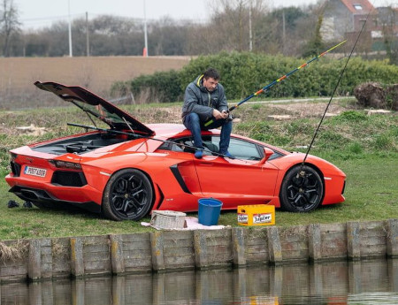

Title:Low-tech
Date: 2023-11-20 02:20
Category:Inclassable
Tags:low-tech
Authors: Anthony Le Goff
Summary:

Je suis pour le développement des low-tech, et généralement j'encourage cette perspective et modèle de société. Il est important de ne pas générer trop de superflu dans notre consommation de technologie pour économiser des ressources et mieux gérer les chaines d'approvisionnement. Ce n'est pas forcément de l'écologie mais juste du pragmatisme. N'achetez pas ce qui vous est inutile. Pourquoi auriez vous besoin d'une Ferrari pour aller au travail? A quoi vous sert un moteur V8, vous ne faites pas de la course automobile? La richesse?

On retrouve cette même logique dans l'informatique, l'open source à permis de ré-utiliser d'ancien PC ou plutôt dans une optique de durabilité. Si vous achetez un PC sous Linux, vous avez pour objectif de faire au moins 5 ans avec voir jusqu'à 10 ans. Cela est possible s'il est répérable et facile d'accès, tel qu'un modèle populaire pour trouver des pièces détachées.

Le Low-Tech lutte contre l'obsolescence programmé et essaye de distribué la technologie au lieu quel soit privative. On retrouve une essence de la Low-Tech entre lien avec l'open source et l'open hardware. Oui, il existe un lien étroit entre l'utilisation de low tech, l'open source et l'open hardware. Ces trois concepts partagent des principes similaires liés à la simplicité, à l'accessibilité, à la durabilité et à la collaboration communautaire. Voici comment ils interagissent :

1. **Simplicité et Accessibilité :**
    - Les solutions low tech se caractérisent par leur simplicité et leur accessibilité. De même, les projets open source et open hardware visent à rendre les technologies et les logiciels accessibles à un large public en permettant à quiconque de les utiliser, de les modifier et de les distribuer.

2. **Participation Communautaire :**
    - Les projets open source et open hardware encouragent la participation communautaire, tout comme les solutions low tech. La collaboration ouverte permet aux utilisateurs de contribuer, de partager des idées et d'améliorer les solutions collectivement.

3. **Durabilité et Réparabilité :**
    - Les solutions low tech, souvent axées sur la durabilité, peuvent bénéficier des principes de l'open hardware. En utilisant des conceptions ouvertes, il est plus facile pour les personnes de comprendre, réparer et améliorer les technologies. Cela favorise la durabilité et la réparabilité des objets.

4. **Réduction des Coûts :**
    - L'open source et l'open hardware peuvent contribuer à la réduction des coûts, un principe également important dans le low tech. En partageant des plans et des logiciels, les coûts de développement et de production peuvent être réduits, rendant les technologies plus abordables.

5. **Adaptation Locale :**
    - Les solutions low tech, souvent conçues pour s'adapter aux ressources et aux besoins locaux, peuvent bénéficier de l'approche open source et open hardware. Les utilisateurs peuvent adapter les conceptions existantes pour répondre à leurs besoins spécifiques.

6. **Liberté d'Utilisation :**
    - L'open source et l'open hardware promeuvent la liberté d'utilisation des technologies. De même, les solutions low tech visent souvent à fournir des alternatives indépendantes et accessibles.

7. **Innovation Distribuée :**
    - L'approche open source et open hardware favorise l'innovation distribuée, où des personnes du monde entier peuvent contribuer à l'amélioration des technologies. Cette approche peut également être bénéfique pour le développement de solutions low tech innovantes.

Ensemble, ces concepts contribuent à une approche collaborative et ouverte du développement technologique, permettant aux utilisateurs d'être plus impliqués dans la création, l'adaptation et l'amélioration des technologies, que ce soit dans le domaine du low tech ou au-delà.

Bien sur Low-Tech ne veut pas dire retourner à l'âge de pierre, on vous demande pas de faire fonctionné votre machine à laver avec un vélo pour faire tourner le tambour. Cela est ridicule. Certain diront que c'est plus écologique, mais à part cette argument, aucun intérêt à part d'utiliser votre temps. Pendant que vous pédalez, vous ne pouvez pas faire autre chose. Jaime particulièrement les maisons low-tech, et les tiny house qui sont autonome. J'aimerai vivre à la campagne dans une [tiny house](https://mygreencocoon.com/low-tech-tiny-house/), dans une maison autonome, sans pourtant être coupé de l'electricité ou d'internet ou de l'eau. Mais vivre à la campagne il faut un voiture.

Dans une maison low-tech voila se que l'on peut intégré:

* une marmite norvégienne
* un poêle de masse
* une phytoépuration 
* un capteur à air chaud
* un chauffe-eau solaire 
* des panneaux photovoltaïques
* des toilettes sèches 
* un récupérateur d’eau
* une douche à recyclage
* un filtre à eau
* un compost bokashi
* un garde-manger

De ce fait, il est conseillé pour plus d'autonomie d'avoir son potager et de cultiver des parcelles de terre, cela n'est pas négligeable tel que l'optique du survivalisme. Personnellement pour des questions de rendement, je préfère la culture aquaponique et verticale. J'ai mes avis sur l'agriculture et les modes urbaines ou la terre est limité avec de faible parcelle. Dans ma famille, on à encore 3 hectares, héritage car nous sommes des paysans à l'origine. Ma grand-mère et mon grand-père avait une ferme et vivait en pleine campagne, le bourg le plus proche est à 6km.  

Le Low-Tech est à la mode car cela attire son aspect communautaire, la réparabilité et la durabilité, c'est un pied de nez contre la société de consommation et donc le capitalisme.