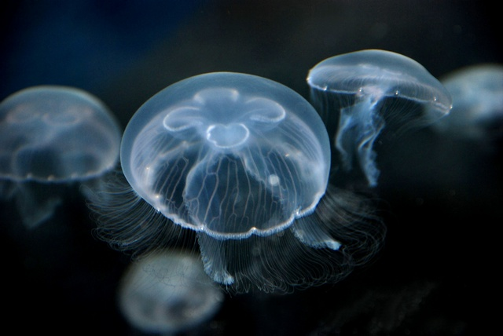

Title:Aquarium et vie des méduses
Date: 2023-08-07 05:49
Category:Inclassable
Tags:aquarium, meduse
Authors: Anthony Le Goff
Summary:

J'ai eu le droit à une petite cure de rappel à ma libération d'hopital psychiatrique à Brest par la visite d'Océanopolis et l'atelier sur les planctons.

Elever des méduses est très particulier. Il faut deux élements essentiels:

* Un cycle azoté
* Un courant

Et bien sur un aquarium (un cristal) pour leur conservation.

De quoi ce nourrit les méduses? Essentiellement du zooplancton, mais également des algues ou des oeufs de poisson.

La première fois que j'ai acheté une méduse, j'ai fais la mauvaise expérience que celle-ci dans son pochon et emballage avait disparu, disloqué et soluble dans l'eau au bout de 3 jours. Un raté.

La méduse est le plus grand des planctons tout en restant un animal fragile, elle n'a pas de propulseur pour ce déplacer comme les poissons et les nageoires. Ou des bactéries et les flagelles. C'est à dire que les filaments n'est qu'un filet pour capturer des proies et systèmes de defense contre des prédateurs. Comme l'injection de venin. Elle utilise le camouflage et donc est translucide pour de la furtivité.

La méduse n'a pas de cerveau, elle a un réseau neuronal, environ entre 8700 et 17500 neurones, mais ne comporte pas de synapse réparti dans tous le corps, ce n'est pas un système centralisateur comme le cerveau. C'est très peu, un cerveau humain comporte 86 milliards de neurones. Les méduses existent depuis 505 millions d'années, et donc remonte au Cambrien. Est très résistante aux exterminations massives tel que l'extinction permienne qui a détruit 95% de la biodiversité marine il y a 252 millions d'années. 

### Cycle de l'azote

Pour produire un cycle azoté, il faut soit une eau riche en nitrate, soit des déchets organiques, tels que des algues. Il faut également filtrée l'eau, et la purifier tout en injectant de l'air qui est composé: d'azote (78,08 %), d'oxygène (20,95 %) et, pour moins de 1 %, de gaz rares. Dans de rares cas, il peut ce développer des blobs dans les aquariums.

### Le courant

Générer un courant est plus complexe, il faut une forme spécifique, circulaire. Ainsi les aquariums à méduse sont en forme d'anneau. De plus il faut généralement une lampe à ultraviolet pour l'observer.

La plus commune chez les aquariophiles est l'Aurelia Aurita. 

Si vous voulez élever des méduses, chez [Recif'Art](https://www.recifart.com/fr/aquarium-a-meduses/10200-mini-o2-kit-de-demarrage-meduses-aquarium-a-meduses.html) il y a des aquariums à partir de 449€.

Ce qui fait le design particulier, ces aquariums sont cher.