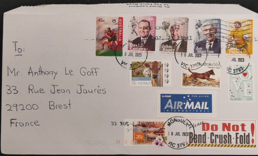
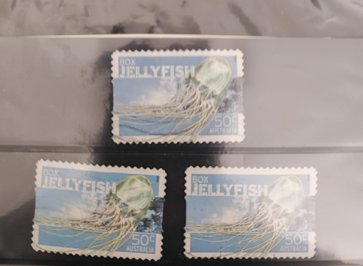

Title: L'affaire méduse-boite
Date: 2023-07-26 12:23
Category:Inclassable
Tags:timbres
Authors: Anthony Le Goff
Summary:

Aujourd'hui je viens de recevoir ma petite commande d'Australie (pays d'Oz) chez un particulier acheté sur le site Delcampe. Je suis un collectioneur de timbres.

J'ai commandé 3 timbres originaux collection "Dangerous Animal" Box Jellyfish (Chironex fleckeri) d'Australie.

Et surprise! Le lettre est un peu spécial, des tonnes de timbres.

Voila ce que j'ai reçu pour 6€ (frais de port inclus) à garder et archiver dans les capsules temporelles.

