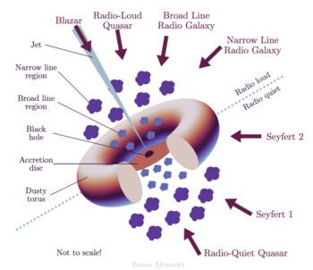

Title:Le point carrée
Date: 2023-10-07 09:40
Category:Inclassable
Tags:design principe
Authors: Anthony Le Goff
Summary:

J'aime bien faire des choses pas trop compliqués, que je peux retenir facilement de mémoire. Je suis un partisan des design simple que l'on complexifie subissant des transformé et symétrie temporelle.

Alors j'étudie les symboles et parfois la géométrie sacrée pour trouver des patterns. Et j'aime bien la Svastika. Qui a été réutilisé par les nazies. Ce pattern représente une abstraction du vortex sous le symbolisme du "point au carrée" tel que la problématique de la quadrature du cercle qui pose une anomalie de l'espace-temps. C'est un problème de géométrie basic ou il y a en théorie aucune solution créant un système instable avec des valeurs approchés vers l'infini créant un oscillateur d'harmonique. Cela devient un problème de topologie. Un vortex est un noeud dans le réseau tel qu'un point de routage ou s'échange information et énergie. Celle-ci peut-être transformé et converti en un nouveau système. 

Comment créer un noeud rudimentaire chez soi?

Il vous faut deux choses:

J'avais déjà expliquer comme faire des [anneaux supraconducteurs en savon](https://legoffant.github.io/anneau-supraconducteur-low-tech.html). Et une boite metallique carée qui va générer des fluctuations quantique avec des harmoniques précises selon la forme géométrique localement. Cel ce trouve facilement via des gateaux bretons qui vendent [des boites metalliques](https://www.patisseriebretonne.fr/boite-galettes-palets-bretons-480g-motif-carte-bretagne-c2x39544086).

Le vortex peut-être une aproximation des galaxies. Il est une source radio qui permet d'accélérer les transmutations et de contrôler le temps. Vous pouvez faire des expériences, tel que produire du deuterium à base d'eau salée. Vous pouvez aussi faire transmuter de l'ADN.

J'avais également expliquée une autre expérience et la question du [problème à trois corps](https://legoffant.github.io/anomalie-gresillement.html) pour reconfigurer l'espace-temps et forer un puit d'énergie.
