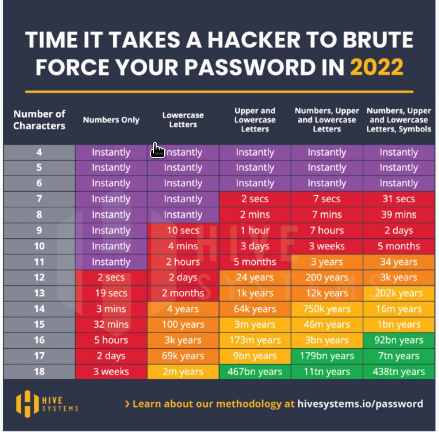
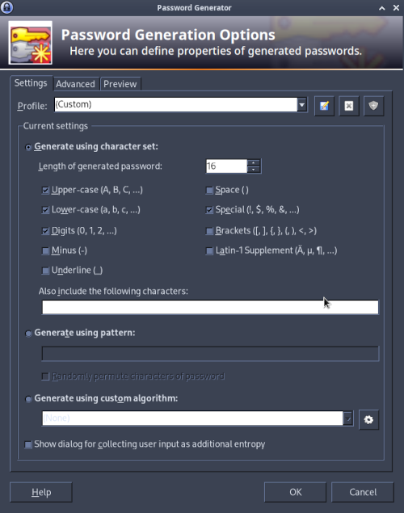
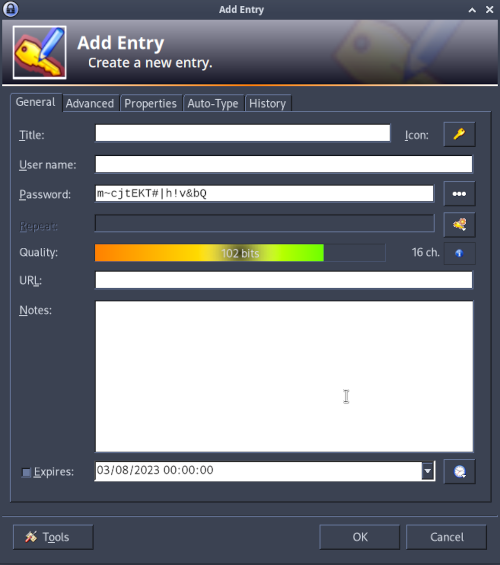

Title:Rappel: politique de mot de passe forte
Date: 2023-08-03 08:12
Category:Inclassable
Tags:mot de passe
Authors: Anthony Le Goff
Summary:

Les gens, le pecnot moyen néglige les mots de passe, c'est une calamité. La plupart on rien à foutre et font n'importe quoi. C'est open bar leur PC sur Windows.

REGLE:

1. On note jamais un mot de passe sur du papier (t'a une mémoire, et alors utilise là)
2. On note jamais des mots de passe en clair dans vos documents numérique sur votre ordinateur
3. Un mot de passe basic comporte 12 caractères (Alpha-numérique + Majuscule + Minuscule + Symbole) (attaque par brute-forcing)
4. On utilise du l33t
5. Les mots ne doivent pas exister dans le dictionnaire (attaque par dictionnaire: worldlist)
6. On utilise un gestionnaire de mot de passe local sur l'ordinateur (pas dans le cloud) dans une base de donnée chifrée (ie: keepass)

Pour tester vos mots de passe, vous pouvez utiliser des outils comme `hydra`, `hashcat`, `john the ripper`.

**D'autres diront, rien à taper, j'ai rien a caché!**

* T'as pas de porte feuille de crypto-monnaie sur ton PC?
* T'as pas des clients à protéger et leurs infos si tu fais du business?
* Et tes photos de vacances et tes nudes? On pourrait te faire chanter sur tes sextapes?
* Et tes mots de passe que tu enregistres automatiquement sur ton navigateur?
* Tu utilises des clés SSH pour t'authentifier sur des serveurs distants?

En général il faut trois types de mots de passe:

1. Le mot de passe de partition chiffrée (16 caractères, + 90 bits)
2. Le mot de passe root / admin qui est souvent le même que l'utilisateur via sudo sous Linux (+12 caractères, + 64 bits)
3. Les mots de passe de website (dynamique) (+12 caractères, + 64 bits)

Pour avoir un mot de passe très sécurisée, résistant aux plus gros supercalculateurs: 128 bits.

Comment peut-on savoir ça? Via Keepass en générant un mot de passe.

Config generator

Add entry

**Astuces mémotechniques:**

mot de passe utilisateur + séparateur + code crypté = mot de passe de partition chiffrée

ex: m3ss!ePSG75/p@rt

* mot de passe utilisateur: m3ss!ePSG75 = contatenation de "messie"(l33t) + "PSG" + 75
* Séparateur: /
* code crypté: p@rt

TOTAL: 16 charactères

Pour les sites web, dynamique. On utilise l'URL du site après le mot de passe utilisateur

ex: m3ss!ePSG75/E

* mot de passe utilisateur: m3ss!ePSG75
* spérateur: /
* code site web: E
* Site web: Google.com => on récupère la dernière lettre en majuscule: E

