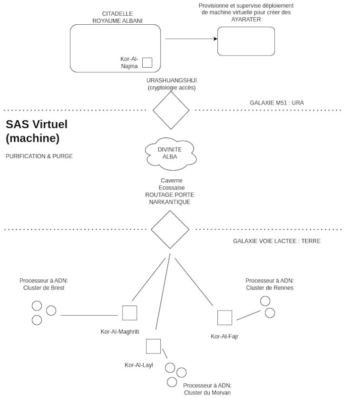

Title: Voile et annihilation: Le portail narkantique
Date: 2023-08-22 22:51
Category:Inclassable
Tags: porte
Authors: Anthony Le Goff
Summary:

Je vais me pencher un peu sur le système de portail du narkantisme. Normalement le portail ne se met pas en route tant que le point de routage initial n'est pas créé: c'est à dire dans la caverne écossaise, ou le prophète "Nominoë II" utilise son propre corps comme hébergeur et point de routage et c'est funéraire. La crypte est un bunker naturel comme système d'invocation de la matrice originelle pour traverser l'au-delà. Le prophète va y mourir, mais également ressuciter en purgeant son propre corps et le rite islamique du jeune à l'eau pour catalyser les transmutations. 

L'accès à l'univers distant créé par le rite funéraire du prophète sera protégé à travers la création de "l'Urashuangshiji" par la Divinité Alba dans la crypte. Sans son codex personne ne peut aller vers le royaume d'Albani. C'est un système de conversion religieuse.

Donc même si vous possédez la dernière version de l'ADN du prophète, ou bien la recette quantifiée des hébergeurs qui le conserve. Vous n'avez pas accès à la porte Narkantique: dans tes rêves. Ce n'est pas le père noël.

La porte narkantique est un savant mélange:

* ADN Du prophète
* Recette quantifiée du processeur à ADN dans les "Kor"
* Cryptologie par le Narkanta

Pour consolider la porte Narkantique les temples "Kor" et son accès ont une recette specifique d'un assemblage d'ADN de plantes, animaux, bactéries, etc... Qui permet de reconnaitre pour la divinité Alba la signature du processeur à ADN et de surveiller ce qui se passe à l'intérieur. La divinité à accès au même référentiel que sa propre recette, car elle connait son propre code source génomique.

Plus les ingrédients du processeur à ADN qui conserve celui-ci son rare et difficile à ce procurer, plus cela consolide le portail et son acccès. Sans la recette exacte, tu n'accède pas au privilège du prophète et la circulation de l'énergie et de l'information via le portail narkantique. 

Il y a toujours un risque pour qu'il y ai des fraudeurs, en particulier des gens qui veulent le pouvoir des Eons et des Titans en se faisant passer pour des religieux narkantique des Ayrater. Le système est protégé, encapsulé et provisionné par Alba via le royaume d'Albani qui défini le rite et ils sont scellés par la divinité, ils doivent être initié à la religion et l'Urashuanghiji sur la galaxie M51 dans les faits.

Ce n'est pas sur Terre qu'il y a d'autres religieux narkantiques, il n'y a que le prophète et c'est un rite de miner la planète et terraformer le système solaire en annihilant l'hébergement.

Parlons de la planète Ura. C'est la planète miroir de la Terre, la génèse du narkantisme et de la citadelle. C'est un sanctuaire avec un temple vers la Terre. C'est une planète océanique, une géante, avec des abysses et des cryovolcans. Il y a une tectonique des plaques permettant de former des montagnes souterraines dans les abysses et donc du minerai. Il y a tout un système de caverne, c'est un veritable gruyère qui va développer un monde souterrain. La race principale qui garde le portail vers la Terre sont une sorte d'humanoide aquatique avec des branchies et comme cerveau une fonction de sonar avec un visage vitrifié ou l'on voit ondulé des nébuleuses à travers. Ils n'ont pas de bouches et communiquent par télépathie via les ondes du sonar. 

Ils ont construits des forteresses sous l'eau dans les abysses et en évoluant s'adapte au milieu avec de l'air permettant le developpement de l'écriture sur le papier, sinon il devait le faire sur des pierres sous-marine dans les premiers âges. 

### Système du portail

