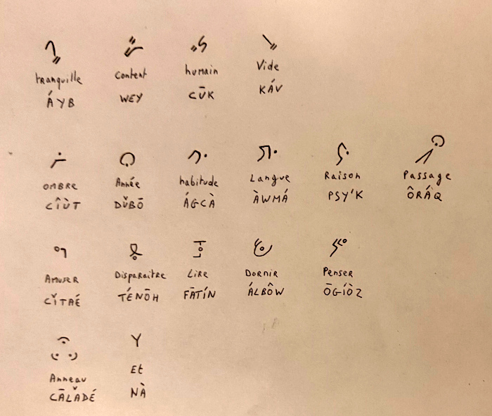

Title:A quoi ressemble le Narkanta ?
Date: 2023-10-08 02:13
Category:Inclassable
Tags:narkanta
Authors: Anthony Le Goff
Summary:

Je me suis dis, je peux bien montrer quelques mots de Narkanta pour montrer à quoi ressemble le langage. J'ai donc mis environ 10 mots en Narkanta pour présenter le langage sur les 600 que composent le dictionnaire usuel standard. Vous pouvez reconnaitre des particularité du langage qui utilise la dualité onde-corpuscule: un point et une ligne (au moins). On étudie la brisure de la ligne et sa duplication dans les primitives du langage. Le point ici est representé par des librairies (deux tirets, points et petit rond). 

Le narkanta est un langage ordonnancé en champs lexical en natif, c'est à ça que l'on reconnait par l'utilisation de la dualité onde-corpuscule. Quelques glyphes n'ont pas de librairie, j'ai un exemple: une conjonction de coordination "ET". 

De plus vous pourrez constater que dans la translitteration phonétique: il y a un nombre de lettre précis qui défini un champ lexical. 3 (tiret), 4 (Point), 5(Petit rond). Ce qui change les phonèmes et la complexité des sons.

Egalement c'est une langue tonale, et il y a les signes des tons sur les voyelles. Il y a 5 tons comme le chinois. 

Vous pouvez remarquez que les mots narkantique sont parfois complexe et très particulier, et n'ont rien à voir avec la plupart des langages latins. Pour avoir un tel changement d'entropie informationnel, j'ai généré des mots de manière aléatoire avec un algorithme à partir du nombre de lettre. 

Après la graphie des glyphes est particulière, ce n'est pas du chinois et cela ressemble plus à des runes. 

La création du narkanta est un exercice difficile j'ai travaillé des années 2 ans, pour réfléchir aux concepts du langage et le finaliser. C'est particulièrement hardu de créer 700 glyphes différents et variés. J'ai eu des pannes d'inspiration, des fois j'en faisais une dizaine dans un mois, puis j'avais plus d'idée. Alors quand je me disais qu'il y avait plus de 512 à faire, cela risquait d'être long.

Tout le langage est fonctionnel pour être parlé, avec une structure grammatical. Il est ultra léger et tiens dans 30 pages A5 à sa compilation. 