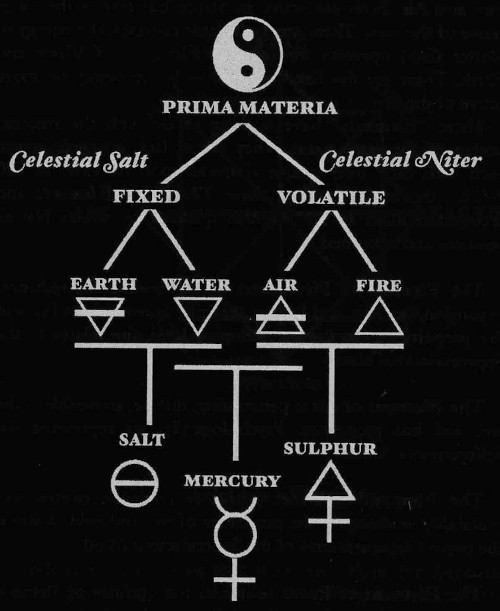

Title:Processeur à ADN et les éléments [Biohacking]
Date: 2023-08-10 22:10
Category:Biohacking
Tags:processeur, adn
Authors: Anthony Le Goff
Summary:

Ma fiole prototype de mon processeur à ADN n'est pas parfaite, il manque des ingrédients et doit subir un patch. En bon noob, j'ai oublié quelques bases.

Rappel des alchimistes: **Les Eléments**

* L'eau
* La terre (fertile, riche en Penicillium, bactéries, des plantes tel que des algues)
* L'air (il faut laisser une bulle d'air dans la fiole, pour mettre sous pression hermétique)
* Le feu

Il faut en plus avoir:

* Du sel
* Du souffre (nitrates et engrais)
* Du mercure (contrôle la température, métal liquide)

La fiole va subir un gros patch.

Il manque l'élément feu et le mercure.

Pour cela:

* Le feu: via de l'encens à bruler pour obtenir de la cendre, invoque la sac à charbon.
* Le mercure: un interrupteur PZ101

Patch attendu pour fin Août pour la périgée lunaire.

