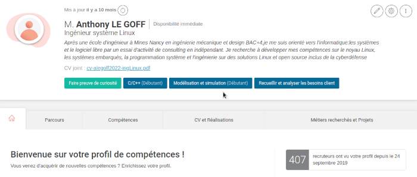

Title:Le désert de pole emploi
Date: 2023-10-11 17:55
Category:Inclassable
Tags:pole emploi
Authors: Anthony Le Goff
Summary:

Je suis écoeuré de ma recherche d'emploi, si je n'avais pas eu de la maladie mentale fini incarcéré et en UMD je n'aurai pas un revenu correct pour vivre et je serai resté cloué à la campagne dans une famille qui ne voulait pas toujours de moi: j'étais un encombrant. Alors j'ai fais un peu de la rue, ce qui est impensable vu mon niveau scolaire, je suis passé par les meilleurs écoles et c'est noté sur mon CV. 

Et l'acharnement sur mon cas continu car je trouve pas d'emploi sur Brest, mais en plus j'ai lancé mon entreprise, et pour l'instant mon bilan sur un mois ne donne rien: aucune touche sur mes prospects. J'ai déjà envoyé 80 mails.

Alors on peut ce demander que ce que cherche certain, des politiques, des gouvernements en particulier sur les musulmans qu'ils ne s'incèrent pas correctement dans la societé ou on peut d'opportunité d'évolution et de carrière. On s'étonne même de la récidive, je suis un ancien tolard avec des antécédents et je me dis que la société est moins aggressive en tôle après un délit ou l'on est nourris et loger que de subir la rue.

Perso je ne vois aucune éclairci en tant qu'ancien tolard et patient d'UMD reconnu travailleur handicapé: au ban de la société, et s'il y n'avait pas l'AAH pour vivre à minima et être autonome on serait seulement des ombres à la rue car le système capitaliste netoye les opposants politiques et activistes soit par le suicide, et quand il n'y arrive pas: les morts dans la rue. En faisant en sorte de vous invisibilisé. C'est honteux dans un pays qui s'affirme démocratique et promoteur de la liberté, égalité et fraternité: c'est tout le contraire et un nid d'hypocrite.

Oui j'ai de quoi destester la France et ces dirigeants, car peu de personne on experimenté ma propre vie. Mais j'ai réussi mon objectif attaquer la réputation des grandes écoles que ces élèves pour la plupart des bourgeois méprise totalement les familles ouvrières comme moi et donc les politiques ne font rien pour aider l'ascenseur sociale, au contraire ils cherchent toujours à être plus consanguin entre eux et ce reproduise entre caste sociale. Guerre des classes qui ensemence la France en réalité et la reproduction des élites.

PJ: Mon profil pole emploi pour les recruteurs, 407 vues aucune demande d'emploi ou d'entretien d'embauche pour un ingénieur système Linux...Si c'est pas louche ça.

PJ2: Mon CV > [CV-alegoff2022-ingLinux.pdf](images/cv-alegoff2022-ingLinux.pdf) < 

