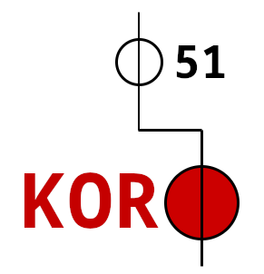

Title:Projet Kor 51
Date: 2023-09-07 02:47
Category:Entrepreneurship
Tags:kor51
Authors: Anthony Le Goff
Summary:

J'ai lancé un nouveau projet. En réalité, j'abandonne l'idée de relancer Alpharatz car la marque m'a été piqué depuis....C'est génant. Donc bienvenue au projet "Kor 51". Avec un nouveau site comme landing page que je suis en train de prototyper comme vitrine pour mes services de freelance IT. J'ai acheté le nom de domaine, vous pouvez vérifier, le site est en cours de construction: [http://kor51.org](http://kor51.org)

Maquette du site [landing page], j'ai utilisé Hugo.

Image 1: [https://imgbox.com/UI6PblIl](https://imgbox.com/UI6PblIl)

Image 2: [https://imgbox.com/QIWhl0cA](https://imgbox.com/QIWhl0cA)

Le site est basic:

* A propos
* Contact
* Services
* Ressources

Pour les ressources j'ai ajoutez des liens vers de la documentation en libre accès que vous pouvez accéder que j'ai moi même construit:

* [Wiki](https://kor51.tiddlyhost.com/)
* [Librairie](https://mega.nz/folder/MkJAHBQS#ZUtfIhQr3dyv1QeCCdBiyQ)

J'ai également ajoutez ma clé public PGP pour mon email sur un serveur pour me contacter avec du chiffrement. [A cette adresse](https://keyserver.ubuntu.com/pks/lookup?search=0x6F3B7C4C&fingerprint=on&op=index).

Ce que j'ai fais aujourd'hui: 

* Reprise de contact avec le portage salarial
* Création de micro-entreprise à partir de mon ancien SIREN
* Achetez de nouvelle carte de visite à jour pour le projet Kor 51
* Achat de nom de domaine

**LOGO** de la marque (qu'il faut que je dépose pour pas me faire de nouveau piquer)

Ceux qui savent, c'est le glyphe narkantique pour le mot temple "Kor". L'hébergeur.

Ce qu'il reste à faire, idéalement je compte auto-héberger chez moi sur mon serveur Proxmox le projet Kor 51. Si mon réseau local est up dans les 15 jours.