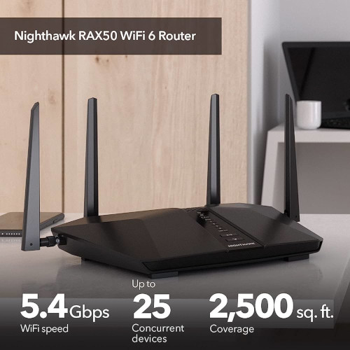

Title:Routeur NETGEAR Nighthawk RAX50
Date: 2023-07-28 13:08
Category:Linux
Tags:routeur
Authors: Anthony Le Goff
Summary:

Suite à la cyberattaque pour renforcer mon réseau local chez moi, j'ai pris la décision d'acheter en urgence un routeur dernière génération avec des fonctions en sécurité réseau.

Mon choix va vers le NETGEAR Nighthawk RAX50 pour son rapport qualité / prix à 230€ sur le site officiel de NETGEAR.

Il va être derrière la BBox qui gère la fibre. Je vais désactiver la fonction WIFI de la Bbox et passer en DMZ le routeur NETGEAR, en particulier pour ouvrir les ports pour mon serveur Proxmox sur internet.

Entre autres il intègre en fonction de sécurité:

* VPN, accès sécurisé
* NETGEAR Armor service à 99€/an 
* WPA2/WPA3
* Protection DoS 
* Double Firewall

On peut paramêtrer les DNS, ce que ne permet pas la Bbox et outrepassé les DNS du FAI et donc la censure du web.

J'ai également besoin des fonctions:

* WPS (pour facilement paramêtrer mon imprimante HP Laser)
* USB 3.0 pour ajouter un support de stockage pour un backup local de mes VM: virtuals machines Proxmox.

Fuyez les routeurs des FAI, ils sont backoorés. Malheureusement pas le choix d'en avoir un pour connecter la fibre. Les FAI et les gouvernements ne veulent pas que l'on est notre propre routeur perso. C'était possible avec l'ADSL mais depuis la fibre: c'est limité. Donc on rajoute un routeur en plus sur le réseau derrière le point de routage box de la fibre.

Le gouvernement français ne fait rien pour l'aide à l'auto-hébergement et les FAI indépendants tel que [FDN](https://www.fdn.fr/). C'est la guerre, et la neutralité du net une utopie.