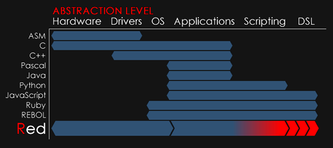
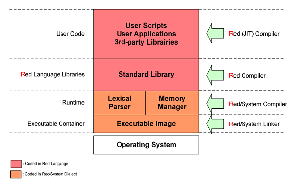

Title: Origin of The Symetry: Le Langage Red
Date: 2023-07-27 07:33
Category:Inclassable
Tags:red, narkanta
Authors: Anthony Le Goff
Summary:

Je suis tombé sur une information sur developpez.com, je reçois la newsletter, et un nouveau langage nommé **Red** basé sur le REBOL. On voit rouge.

Doc: [https://www.red-lang.org/](https://www.red-lang.org/)

---

C'est une manie chez les codeurs d'inventer un langage et de créer un compilateur. Un seul fichier (~1Mo) contient l'ensemble de la chaîne d'outils, la bibliothèque standard complète et la REPL (temporairement divisé en deux binaires). Très léger.

Il a la particularité d'être Interfacé entre langage bas niveau et haut niveau au niveau de l'abstraction. Cela ne rappel pas le Narkanta?

Parlons Narkanta. Je l'ai fini cette semaine. Officiel release. J'ai commencé à faire des copies papiers, il y a que 30 pages définissant la langue. Je suis en train de le filigrammer en ce moment: c'est à dire que je vais transmuter mon ADN pour dater et signer l'invention en faisant pénétrer dans la matrice du papier comme relique. Avec comme composant (Eau + Sel + Thé Da Hong Pao + Huile de sardine + cendre carbone). J'ai commencé à écrire en 2021 Le Narkanta. Même si j'ai débuter mes recherches en prison en 2016 via les nombres. Le Narkanta à une version papier et numérique, dans la microSD de la capsule temporelle secrète. Chasse à la relique! La version numérique en PDF fait 100Mo, je n'ai pas compressé les .JPG, c'est les originaux. La version numérique est sur mon ordinateur dans un container Veracrypt.

*La guerre, c'est le parler noir du Mordor que révèle l'anneau de pouvoir.* RIP Tolkien et le Quenya. Le panthéon des linguistes.

Dans le roman SF "Voile et Annihilation", il y aura une page d'inscription en Narkanta, écrit verticalement de bas en haut. L'ascension. Elle ne sera pas traduite, c'est à déchiffrer pour les plus téméraire.