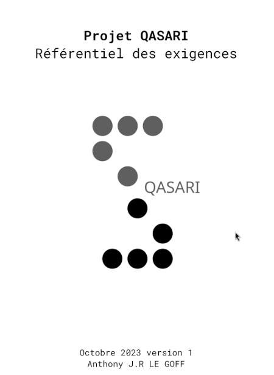

Title:Referentiel des exigences Qasari
Date: 2023-10-31 11:39
Category:Inclassable
Tags:qasari
Authors: Anthony Le Goff
Summary:

Voici un document que j'ai rédigé pour toutes personnes intéressés à travailler sur le projet Qasari et de présentation pour des investisseurs. C'est un document de synthèse inclus:

* Définition du concept
* Mise en place de l'interface utilisateur
* Conception du moteur 2D/3D
* Principe d'utilisation de generation procédurale 
* Documentation et ressources
* Code de base

Lien vers le document PDF >> [Reférentiel des exigences Qasari](https://codeberg.org/legoffant/qasari/src/branch/main/docs/resume/referentiel-exigence-V1.pdf) <<

