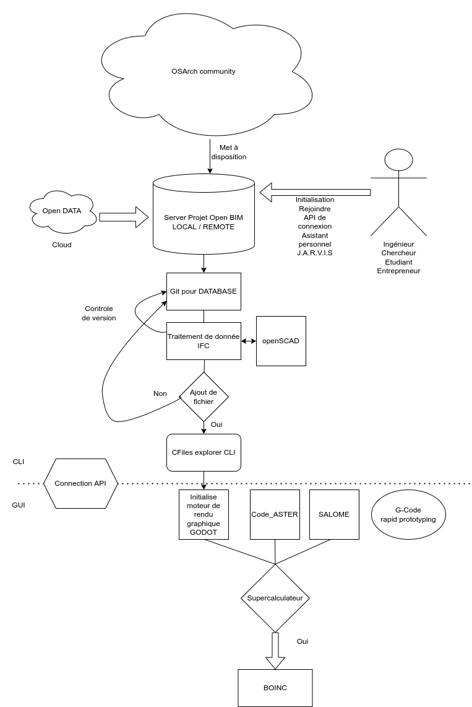

Title: Rendre accessible la création
Date: 2022-01-22 22:47
Modified: 2022-01-22 22:47
Category: Entrepreneurship
Tags: cao, c++, bim, metasploit, ingenierie
Authors: Anthony Le Goff
Summary: 



Je me suis renseigné sur les tendances en conception en particulier le point de vue architecte de système et il y a clairement un déni collectif des éditeurs de logiciel de CAO de croire qu'ils vont survivre avec un business model basé sur la propriété du code et la licence. Tous le monde veut vendre sa merde, c'est désespérant. Je crois bien que la CAO est le caniveau, voir les déchets de la conception logiciel qui refuse de voir la communauté open source imposé ces lois. Il y a plusieurs points à retenir pour survivre:

*   Business model comme rapid7 de Metasploit
*   La modélisation orienté objet tel que l'open BIM
*   La collaboration selon Git sur les systèmes complexes

C'est surement les points critiques de bascule dans l'ère numérique de la CAO ou n'importe quel étudiant ou entrepreneur et ingénieur peut créer un projet d'ingénierie interdisciplinaire. Certains ont flairé le changement tel que la communauté OSArch. A l'avenir comme je le présente on pourra ce connecter via une API à un serveur de donnée d'un industriel pour proposer des modifications et évolutions d'un système. Cela ne sera plus interne à l'entreprise. Des bases de données pourraient rester obscure et protégé sur des systèmes d'armements ou critiques tels que dans l'énergie et les centrales nucléaires avec un accès restreint seulement sous une clé SSH connu par le serveur? La gestion des droits d'accès est tout un programme.

Mais il est clair que les choses vont évoluer. On part d'une base de donnée gérer avec Git qui va ajouter des fichiers à un projet et ces modifications entre différente version pour proposer au mainteneur une meilleure version, si ce n'est pas le cas on renvoi vers un logiciel de moteur de rendu graphique moderne, tel que un Godot engine alléger pour la CAO. Le cloisonnement entre l'industrie des jeux vidéos et la conception en ingénierie est totalement absurde, il faut créer des interfaces. Quand on parle de sprite dans un jeu video, cela fait référence à un objet. Cela permet d'améliorer les effets de rendu, de texture, d'éclairage ou encore de gestion des collisions sur un système en le soumettant à de la physique.

Pour qu'un logiciel soit un succès il doit avoir des interfaces de programmation et API. On initialise des surcouches logiciels pour traiter des données plus complexes comme modules dans un langage de programmation accessible. Godot utilise un langage de script, Metasploit est codé en ruby pour ces modules et Vim intègre ces plugins qui permettent d'évoluer dans le temps. Ces succès logiciels doivent donner des principes sur la conception logicielle.

L'évolution nécessaire aux logiciels de calcul numérique passe par l'intégration de supercalculateur à moindre coût, dans ce sens on peut noter dans le calcul distribué le projet BOINC.

La mise à disposition d'open data par la communauté doit faciliter la formation et la diffusion du savoir ainsi que propager des standards dans la profession par des composants ré-utilisable dans des bibliothèques de connaissance.   

L'utilisation d'une intelligence artificielle comme chatbot en ligne de commande doit faciliter l'accès aux fichiers et à la documentations pour la recherche d'information. C'est un fork du projet d'assistant personnel J.A.R.V.I.S.

Ces pistes sont synthétisé dans ce diagramme:

Ainsi ont peut retrouver les liens vers:

*   [OSArch.org](https://osarch.org/)
*   [What is openBIM?](https://www.buildingsmart.org/about/openbim/openbim-definition/)
*   [AEC open directory](https://wiki.osarch.org/index.php?title=AEC_Open_Data_directory)
*   [ifcopenshell](http://www.ifcopenshell.org/)
*   [BIMserver](https://bimserver.org/)
*   [Liquibase for data is Git for database](https://www.liquibase.com/blog/liquibase-data-git-for-databases)
*   [Godot engine](https://godotengine.org/)
*   [Code\_Aster](https://www.code-aster.org/spip.php?rubrique1)
*   [Salome](https://www.salome-platform.org/contributions/edf_products)
*   [Cfiles explorer](https://github.com/mananapr/cfiles)
*   [J.A.R.V.I.S](https://github.com/sukeesh/Jarvis)
*   [BOINC](https://boinc.berkeley.edu/)
*   [BIM and mechanical engineering - a cross disciplinary analysis](http://file:///home/anth/T%C3%A9l%C3%A9chargements/sustainability-13-04108-v2.pdf)

Le projet sera codé en langage C++
