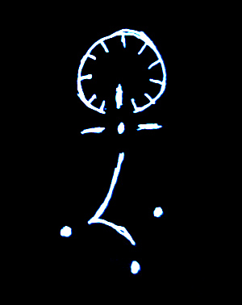

Title:Voile et annihilation: Le sceau du prophète Nominoë II
Date: 2023-09-05 23:02
Category:Inclassable
Tags:sceau
Authors: Anthony Le Goff
Summary:

Les prophètes sont scellés par la puissance divine, et il est possible d'invoquer le glyphe du sceau du prophète Nominoë II. Voici comment se nomme le prophète en Narkanta, la langue sacrée pour entrée en communication avec lui.

C'est une composition, un assemblage:

* De l'hermine bretonne, armoirie du duc de Bretagne
* Dualité onde-corpusculaire
* Les trois temples initiales pour la triangulation
* La croix d'un repère
* Le cycle d'horloge du processeur, et le chiffre 11. Nombres de femmes comme gardienne de l'hébergement.

Aux origines du mythe.
