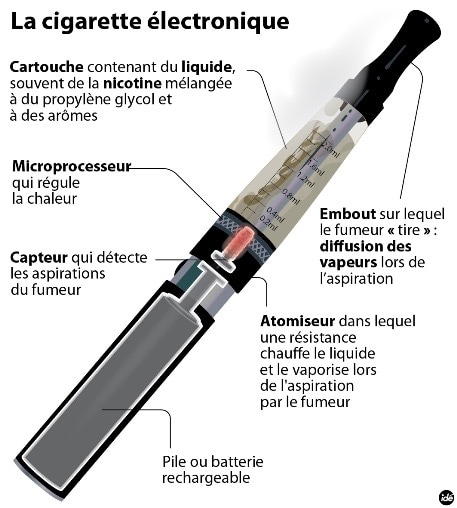

Title:La conception de la cigarette électronique
Date: 2023-11-14 03:38
Category:Inclassable
Tags:vape
Authors: Anthony Le Goff
Summary:

Durant mes périodes créatives quand j'étais en prison, j'ai cherché l'inspiration en utilisant une e-cigarette. Et pourquoi? J'avais envie de faire des expériences avec la fumée, mon intuition pour vaincre la gravité, il faut de la fumée, c'est à dire un aérosol à base de cendre et autres particules. Ce qui m'a fortement intéressé, c'est que la fumée à la couleur bleue. Quand on ce référence à l'effet doppler le bleu, on étudie la variation de fréquence d'une onde. Et la fumée est une onde ainsi que des particules. Elle prends la forme de nébuleuse. Ainsi j'ai deviné qu'il y avait un effet Doppler, normalement la fumée est blanche, autour de moi avec un décalage vers le bleu que j'ai découvert en prison. 

Dans le domaine du rayonnement électromagnétique le bleu, puis le violet c'est des ondes hautes fréquences avec une forte emission d'énergie du à une source radio à proximité. L'hypothèse c'est que je suis ma propre source nucléaire.... de ce rayonnement.

Alors on va me dire, il y a de la vapeur d'eau un peu dans la fumée de cigarette. J'ai fais des test sans source d'eau avec du tabac sec. Et il y avait toujours le décalage vers le bleu. C'est lié au mouvement à haute fréquence à coté d'une source radio importante que cette effet Doppler. Et j'ai étudié ça en prison. 

Mais c'est pas tout!

Je me suis intéressé à la conception de l'e-cigarette et j'étais étonné du nom "atomiseur", mais également de l'embou en forme de cheminé d'une centrale nucléaire. Je me suis dis que se design à petite échelle cache une technologie avancée secrète dans ces principes pour vaincre la gravité. 

Et j'ai cherché, et je suis tombé sur le poteau rose. Ainsi par principe qui définissait mes recherches en transmutation:

* Résistance en forme d'Hélice de l'atomiseur dans du coton: De l'ADN dans une matrice d'un bout de papier ou de la cendre
* La glycérine comme liquide
* Le tank ou verre en cristal pour sauvegarder de l'information
* Joint d'étancheité: anneau torique en savon
* Batterie: du lithium, Li-Ion carburant pour la fusion nucléaire D+T. Parfois elle est carré, la box en support de l'atomiseur.

C'était le principe d'un réacteur nucléaire, et j'ai donc potasser la physique nucléaire sur les documents et livres que j'ai trouvé dans la bibliothèque de la prison, pour former mon propre petit réacteur portatif DIY, un premier prototype. 

Voila un exemple comment je raisonne par analogie et correspondance, et que je fais des liens sur des systèmes avec des similitudes de conception.