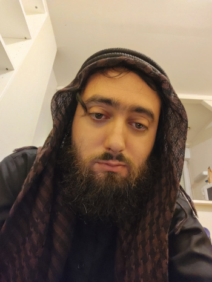

Title:Rare selfie et auto-portrait
Date: 2023-09-14 21:31
Category:Inclassable
Tags:selfie
Authors: Anthony Le Goff
Summary:

Selfie, ou je porte les habilles religieux en tant que musulman, c'est à dire:

* Qamis noir style pakistanais, agfhan
* Kieffieh palestinien noir-marron
* Agal
* chaussure: tongue (je dois acheter des sandales)
* Je suis bien barbu et rase la moustache comme les salafistes. 

C'est bien sur une pratique religieuse à travers des symbolismes et la piété vestimentaire, un vendeur du moyen-orient dans une boutique d'alimentation m'a fait une remarque sur mon Qami qu'il trouvait sympathique. Parfois j'ai quelques regards dans la rue, mais on s'y fait dans Brest.

Je dois retourner à la mosquée à Pontanezen, j'ai plannifié d'aller demain pour la prière du vendredi : Jumuaa. J'essaye de regarder un peu sur internet comment faire le Salat, j'ai un peu oublié, ainsi que la Al-Fatiha en arabe.

J'ai également achété un [Qur'an al-tajwid](https://albayyinah.fr/coran-mushaf-tajwid/2266-coran-tajwid-al-quran-avec-les-couleurs-hafs-arabe-format-moyen.html) en arabe à 18€ pour me forcer à apprendre la langue et l'aide à la récitation. Chez une librairie française musulmane réputée: [https://albayyinah.fr/](https://albayyinah.fr/)

Certain diront que j'ai grossi, j'ai pris 17kgs en quelques années depuis 2018. Mais cela ce voit presque pas, car j'étais maigre, je suis passé d'un tour de taille 36 à 40, je n'ai pratiquement pas de surcharge pondérale. Et mon IMC reste inférieur à 25. Je suis à la diete et je fais du jeune intermittent car je suis sédentaire derrière le PC. 