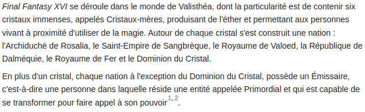
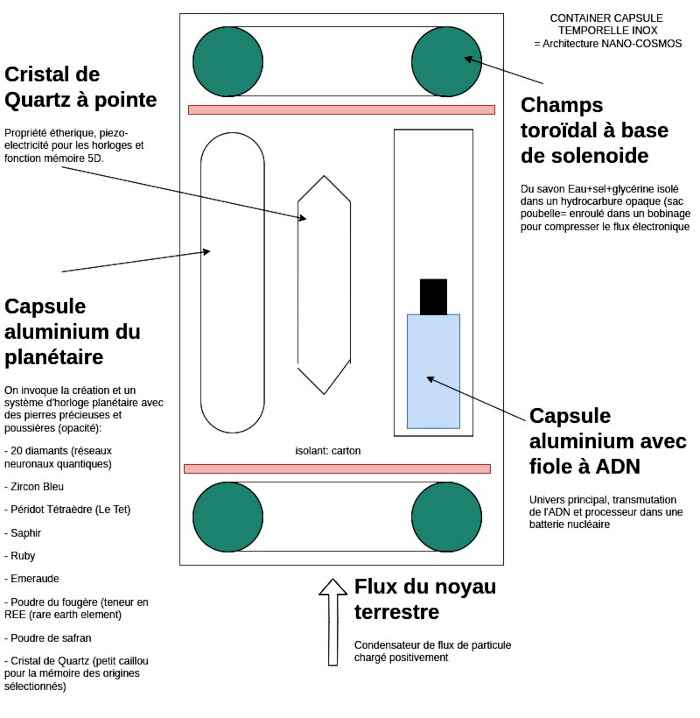

Title:Le royaume de la Kamelott, et systemd des serveurs nucléaires
Date: 2023-07-29 10:25
Category:Biohacking
Tags:concept, architecture, nucléaire
Authors: Anthony Le Goff
Summary:

Pour certain c'est la Kamelott, mais pour ceux qui savent, la création depuis la tradition des alchimistes en héritage des physiciens nucléaires est un système d'invocation (doua) et c'est alimentaire et minérale. Des mineurs. Au délà de la grande bouffe. 

Il y a vraiment des joueurs, en particulier les japonais de Square Enix et la saga Final Fantasy. 

Extrait du sinopsis:

*Non mais A l'eau quoi!*

Alors j'ai préparé une architecture de serveur nucléaire expérimental dans ma campsule temporelle, admirer l'oeuvre de l'artiste.

Il y a des variantes! On peut mettre plusieurs processeurs à ADN (multi-coeurs).

Perso mon serveur a comme capsule et fiole (encapsulsation)

* Batterie nucléaire et fiole à ADN (processeur)
* Capsule de gemmes et poudres (le planétaire) dont le cristal de quartz récolté au bord de l'Isole à Scaër (mémoire)
* Fiole de Fake plutonium 30ML (réserve en eau coloré jaune)
* Fiole de pétrole brute 5ML
* Capsule de graines et plantes (semence, agricole)

Mais on trouve aussi:

* Louis d'Or
* Autunite (source radioactivité)
* des composants d'électronique (Nano-Ordinateur RISC-V MangoPi MQ Pro) - reverse engineering de composant
* Le Narkanta encapsulé version papier, protège par la cryptologie la citadelle
* Une Shungite hypercube 30mmx30mm (filtre à eau, charbon): La Kaaba

Je viens de rebooter(centrifugeuse) mon processeur à ADN, il y a quelques jours, mise à jours. Mais j'ai également néttoyer mes cristaux de quartz avec de l'eau+sel cristalline Isabelle des montagnes noires à la source St-Goazec.

Le serveur, la capsule temporelle a un système de protection et avertissement (contre-mesure), mes petites blagues.
- Panneau Biohazard
- Panneau logo Radioactivité et ionization
- Fiole fake plutonium
- Tirage au sort: on sait pas qu'elle fiole contient le processeur à ADN (copies et clones)
- Enrober dans du papier aluminium (indétectable au détecteur de métaux) et la marmotte?

En cas de découverte: le randonneur s'expose à un danger, cela va générer un buzz et appel d'équipe de déminage. C'est psychologique. Créant une anomalie dans l'univers.
