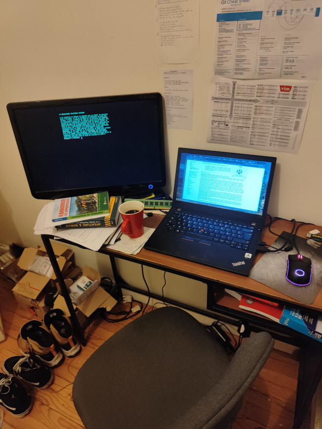

Title:Mon bureau minimaliste [rate my setup]
Date: 2023-09-05 20:54
Category:Inclassable
Tags:bureau
Authors: Anthony Le Goff
Summary:

Je voudrais partagée mon bureau de travail, je suis relativement modeste et utilise une configuration minimaliste comme outil de travail, j'ai un bureau loin des setup de Ouf qu'expose sur internet des développeurs tous ça pour faire un "hello world".

Mon réseau local est en train de ce mettre à jour, j'ai reçu un nouveau routeur Freebox Delta S aujourd'hui et change de FAI. L'installation est prévue pour le 16 septembre ce qui fait que je suis connecté sur internet en ce moment en 5G sur mon smartphone en dépannage que mon réseau local est en rade. 

Je possède sur mon réseau:

ROUTAGE:

1. Freebox Delta S (gère la fibre)
2. NETGEAR Nighthawk RAX50 (réseau protégée double firewall, VPN, DMZ, NETGEAR Armor)

EQUIPEMENT:

* Imprimante HP Laser MFP-179fnw à 300€
* Serveur Proxmox à 1200€ (CPU Ryzen 5, 64GB RAM, 2TO RAID 10, GPU : NVIDIA 1650 GTX)
* NAS Synology DS220j à 220€ (backup)
* Ordinateur Thinkpad T480 sous Arch Linux reconditionné à 499€ en double écran en DVI via HDMI un Samsung vieux de 14 ans.
* PS4 online

Photo de mon bureau ou j'utilise Manuskript en mode plein écran pour l'écriture avec une page ouverte pour documenter le roman. Qui facilite la tâche.

