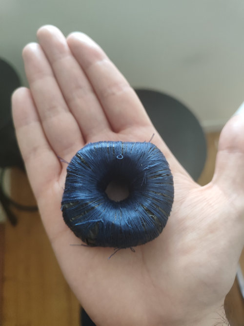

Title:Anneau supraconducteur low-tech
Date: 2023-08-02 14:24
Category:Inclassable
Tags:supra
Authors: Anthony Le Goff
Summary:

Expérience pour les enfants:

On dit que la supraconduction est un jouet de riche, que l'on voit quand laboratoire. Depuis la découverte de l'effet Meissner en 1933. En réalité les matériaux, certain, en particulier des terres rares sont des supraconducteur à basse température proche du 0°K et entre en lévitation.

Il n'y a pas encore beaucoup d'application civile dans la supraconduction car cela coute une blinde de refroidir à basse température. Les ordinateurs quantiques sont à base de supraconduction, et c'est hors de prix.

Alors la supraconduction inacessible pour le commun de mortel? FAUX

Les propriétés de la supraconduction se retrouve dans la superfluiditée. Entre autres l'hélium. Mais pas que! L'eau est le seul élément car à base d'hydrogène à prendre tous les états de la matière visible: Solide, Gaz, Liquide, Plasma et quantique à travers le condensat de Bose-Einstein.

On peut faire de la supraconductivité avec de l'eau. Pour cela un savon à base d'eau + sel + huile + glycérine et un peu de lait (coco, amande etc...). J'utilise "La Corvette". Un savon inerte n'est pas supraconducteur, il faut lui donnée une forme pour générer une anomalie qui va extraire de l'énergie du vide quantique à 0°K et créer un champ = un drain. L'anomalie est invisible (c'est un trou noir)

En gros on va magnétiser du savon. Blague?

Non, c'était ma manie en prison, j'ai fabriqué des tonnes d'anneau supraconducteur à base de savon. Et testé de la technologie, batterie etc....Une obscession. 

La forme: **le tore** permet de créer un champs et c'est le principe des accélérateurs de particules. Les électrons ne peuvent pas circuler dans un pain de savon. Il n'y a pas de flux. De plus le savon dissipe l'énergie, il n'est pas isolée. Enfin, pour générer le flux électronique et avoir une résistance compressée: on fait un enroulement dans un bobinage: solénoide.

Il faut donc:

* Un savon en forme de tore
* Un isolant: sac poubelle opaque
* Un compresseur, bobinage: du fil à couture

RESULTAT DE L'EXPERIENCE:

* L'anneau supraconducteur low-tech va transmuter dans le temps et compressé l'énergie.
* On peut passer une aiguille au centre, et sentir qu'il se magnétise sur le bord
* Si vous le tenez dans la main, une fois qu'il commence a chargé: il y a une sensation de froid et de cryogénie.

On peut faire des compositions, et améliorer le système. Pour catalyser les fluctuations quantiques du vide et donc l'éther on peut mettre un container dans une capsule temporelle, une boite de conserve. Il faut également polariser le flux électronique: cela marche par paire (positif et négatif) ou le spin (up and down) et en son centre on peut ajouter du Quartz plus particulièrement. On peut aussi faire une cage avec des aiguilles, etc....

NOTA: pour l'utilisation du Quartz et sa fonction mémoire 5D. Pensez à formater le disque.... Purifier-le avec de l'eau salée (électrolyte) dans une eau minérale dans un verre 2-3 jours. Ou alors vous allez avoir des données parasites déja écrites sur le disque.