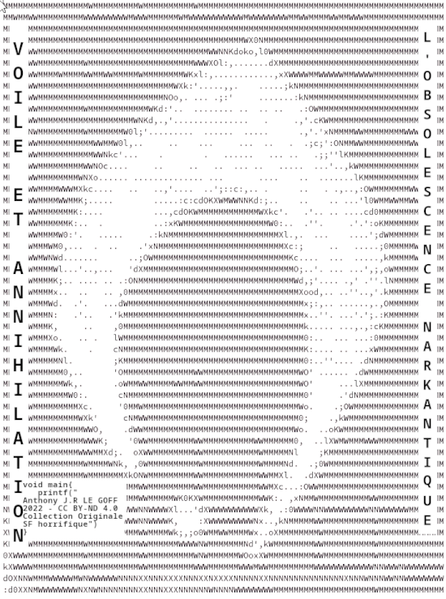

Title:Tetz
Date: 2023-07-28 15:18
Category:Inclassable
Tags:tetz, narkanta
Authors: Anthony Le Goff
Summary:

Mon petit travail d'artiste illustrateur, j'ai une version plus récente de la page de garde sur le couverture de mon roman SF "Voile et Annihilation".

C'est le symbole de la clé glyphique en Narkanta pour le mot "Porte": **Tetz** en transllétération phonétique. Il y a quelques indices, le Narkanta est écrit verticalement. Et des blocks de codes horizontal et vertical. C'est une abstraction de la dualité onde-corspuscule. Mais également des inferfaces hommes-machines. L'âge de l'incertitude. On peut reconnaitre le symbole de l'Islam également et l'arche islamique en architecture: l'ogive. C'est une composition dont je suis assez fier.

J'ai généré cela en ASCII Art pour donner cet effet. Qui est une méthode chez les hackers de l'art numérique. En particulier les bannières de serveurs. J'ai mis un Easter Eggs sur mon blog: une page pour améliorer le web crawling des robots des moteurs de recherche pour indexer le site: [https://legoffant.github.io/robots.txt](https://legoffant.github.io/robots.txt)

